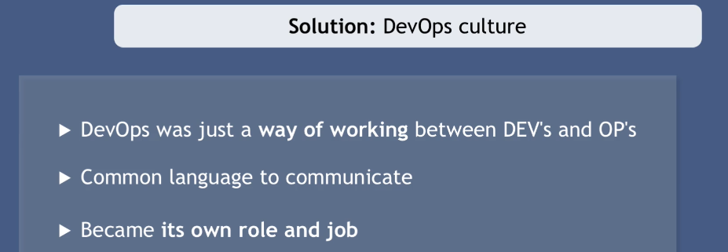

## Introduction to Devops

To build an application, it requires different IT roles in order to make whole application development possible. Let's have a look at the complete <string>Software Development Proces</strong>

### Programming/Development

### Software Testing

If you have existing complex application where you add new features and fix bugs all the time, it is important to make sure those features did not break existing features. 

### Operations
In order to release an application, first, we need to build an application: compress it. Run the application on different servers. In case of application already running on different servers, the new feature gets added, the application needs to be upgraded without any downtime.

When it comes to deploying an application to servers, this is the job of IT operations team.

Now, we can say that we have two different roles: Developers (who develop the application using different programming languages) and Operations (who is in charge of delivering application to production server)

#### Traditional: Development vs Operations

#### Waterfall vs Agile

1- Ineffective process
2- More requirements may arise
3- No immediate feedback

 