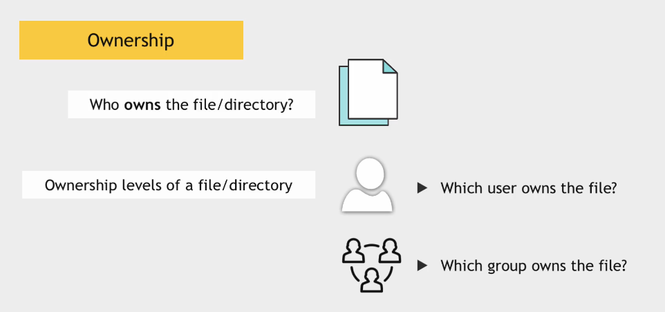
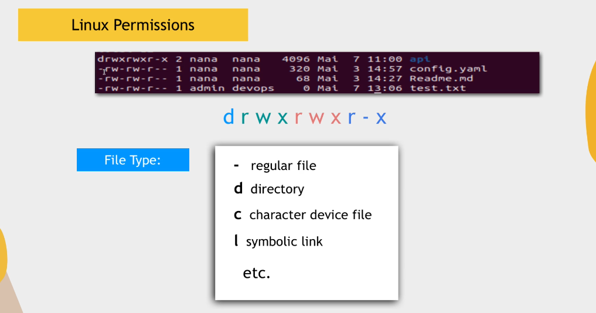
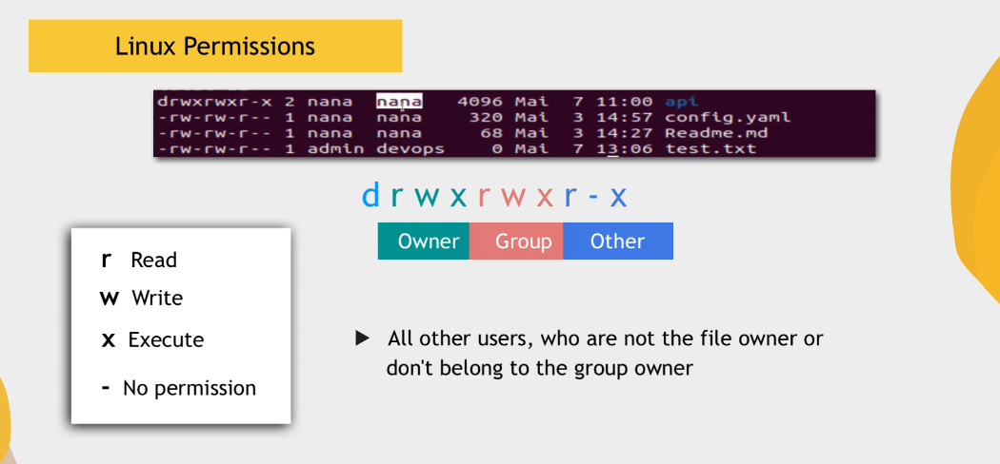
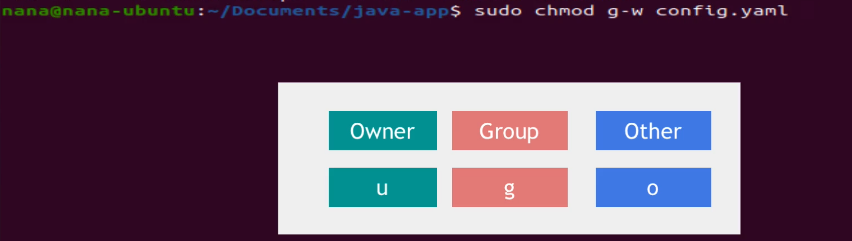
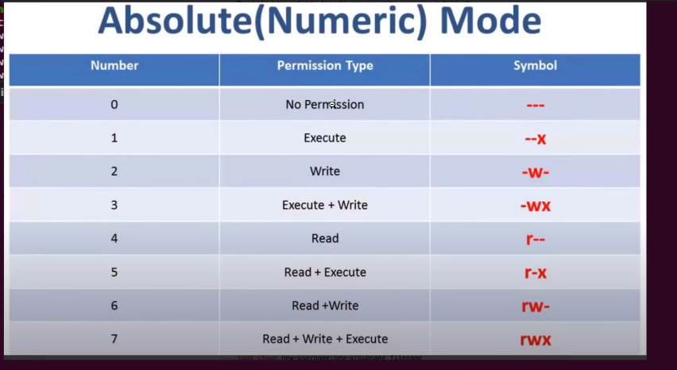
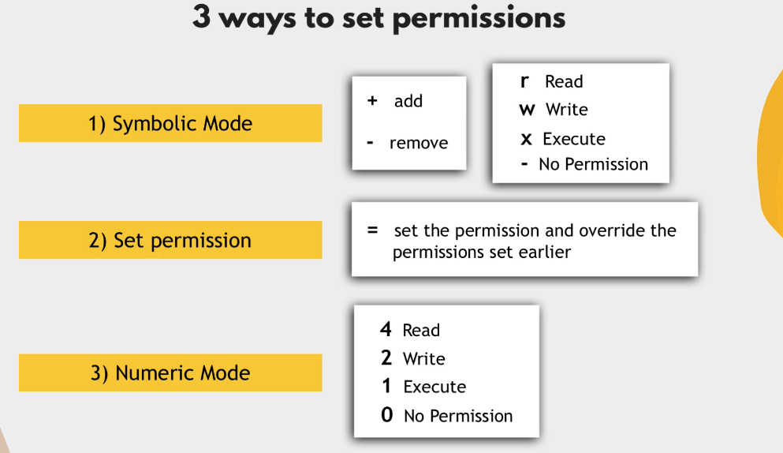

## Linux User and Permissions Part 2

User Permissions are related to reading, writing and executing files.

### Ownership



### Change Ownership


change only group
```sudo chgrp devops test.txt```

### File Permissions



### Modifying Permissions


```sudo chmod g=rwx test.txt```
```sudo chmod g=r-- test.txt```

### Numeric Permission


```sudo chmod 740 script.sh```

