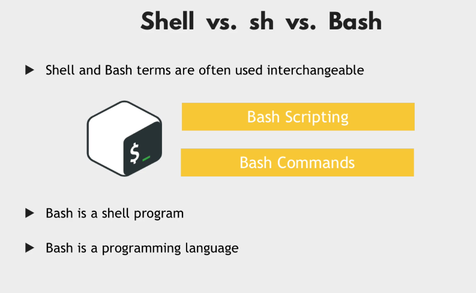
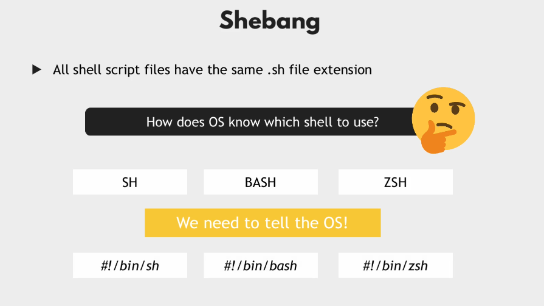
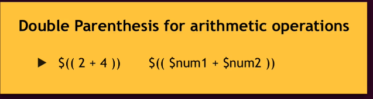

## Introduction Shell Scripting




### Why Shebang



### Conditions


```bash
#!/bin/bash

echo "Setup and configure Server"
file_name=config.yml

if [ -d "config" ]
then
    echo "reading from config folder"
    config_contents=$(ls config)
else
   echo "Config dir not exist. Creating one"
   mkdir config
fi

echo "Using file $file_name to configure something"
echo "Here are all the configuration files: $config_contents"
```

### Basic Operators


### Positional Parameters


```bash
#!/bin/bash

echo "Setup and configure Server"
file_name=config.yml

if [ -d "config" ]
then
    echo "reading from config folder"
    config_contents=$(ls config)
else
   echo "Config dir not exist. Creating one"
   mkdir config
fi
user_group=$1

if [ "$user_group" == "ibrar" ]
then
   echo "Configure the server"
elif [ "$user_group" == "admin" ]
then
   echo "Administrator the server"
else
   echo "No permissions to configure server. No user group"
fi

echo "Using file $file_name to configure something"
echo "Here are all the configuration files: $config_contents"
```

### Loops




When use double square brackets, you don't need to enclose varaibale in quotes


```bash
#!/bin/bash

echo "All the parameters $*"
echo "Number of Paramters $#"

for param in $*
 do
   if [ -d "$param" ]
   then
      echo "Executing script in the config folder"
      ls -l "$param"
   fi
   echo $param
 done

sum=0
while true
 do
   read -p "Enter a score" score
   if [ "$score" == "q" ]
   then
     break
   fi
   sum=$((sum+score))
   echo "Overall Score: $sum"
 done
```

### Functions
A function is way of grouping a set of logic, a set of commands into a reuseable components.


### Accepting arguments in Function


### Use-cases of Bash Scripting
