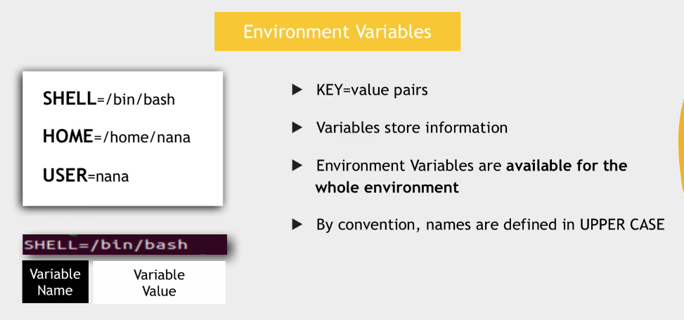
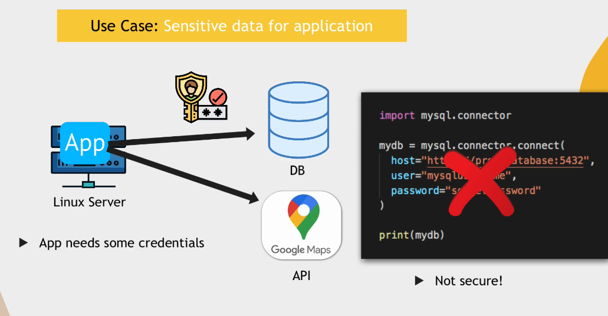
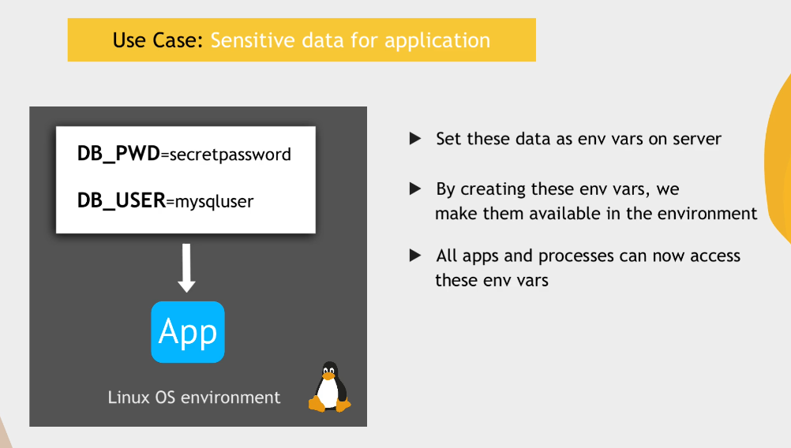
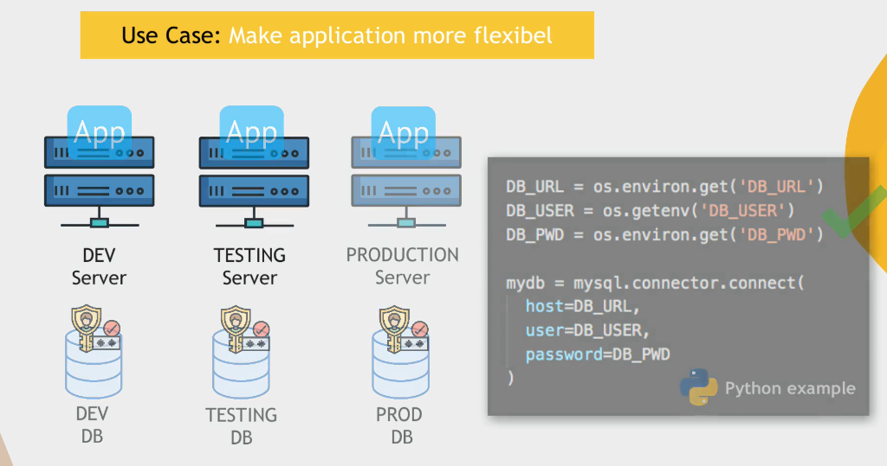
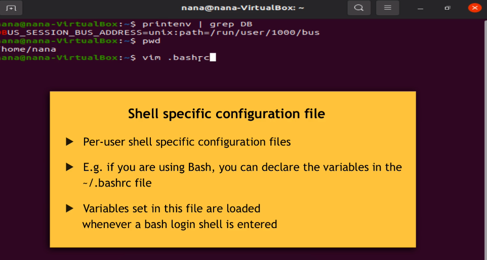
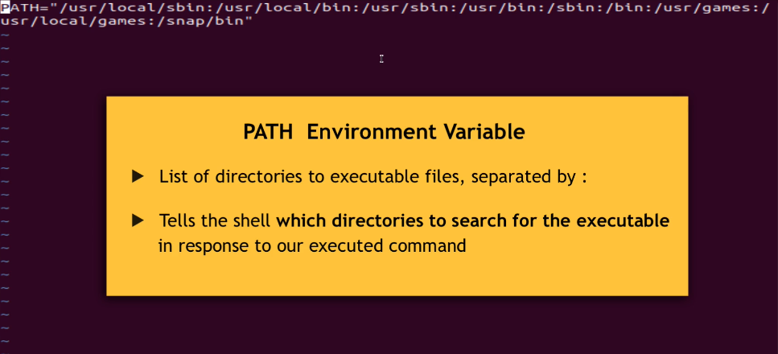

## Environment Variables



printenv = List environment variables

#### why would you want to create your own env vars?




### Creating new Env Variables

```bash
export DB_USER=ibrar
export DB_PASSWORD=ibrar123
```

### Deleting Env Variables
```bash
unset VARIABLENAME
```

### Persisting Environmnt Variables


### Load Env variables once you change in .bashrc file


### PATH Env variable
