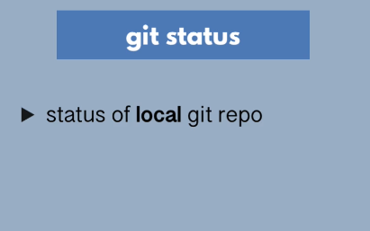

## Git intro


## Git Workflow:




```git add --all```


```git push -u origin master```


### Delete the branch locally
```git branch -d feature/authentication```

## Git Rebase

Let's say you and another developer working on a same branch. you add some changes in the branch and commit it locally. Another developer also add some changes in the branch and push those changes in the remote repository. As you  can see in the screenshot, you don't know another developer changes and another don't know your changes as well. When you push your changes to remote, you cannot do that, you will get an error because there are some other changes that have been pushed already to the remote branch.


First, i need to pull before pushing my changes.


What happens is that git pull basically pulls the changes locally and creates a new commit.


Git rebase helps us tp avoid merge commits

```git pull -r```


## Stop tracking file

```git rm -r --cached node_modules```

## git stash


## Going back in history using commit hash and checkout command


## Undoing Changes and Changing Commits


Imagine, i want to rever the whole commit. since i have it locally not in the remote, i can safely reset the last commit.

```git reset --hard HEAD~2```
Remove lastest two commits

<strong>--hard</strong> means revert the changes and discard the changes that were in the commit

### Git Reset Soft:


```git reset HEAD~2```

### Git commit --amend

Add the changes in the previous commit without creating new commit.


### Remove Commit from Remote repo using revert


