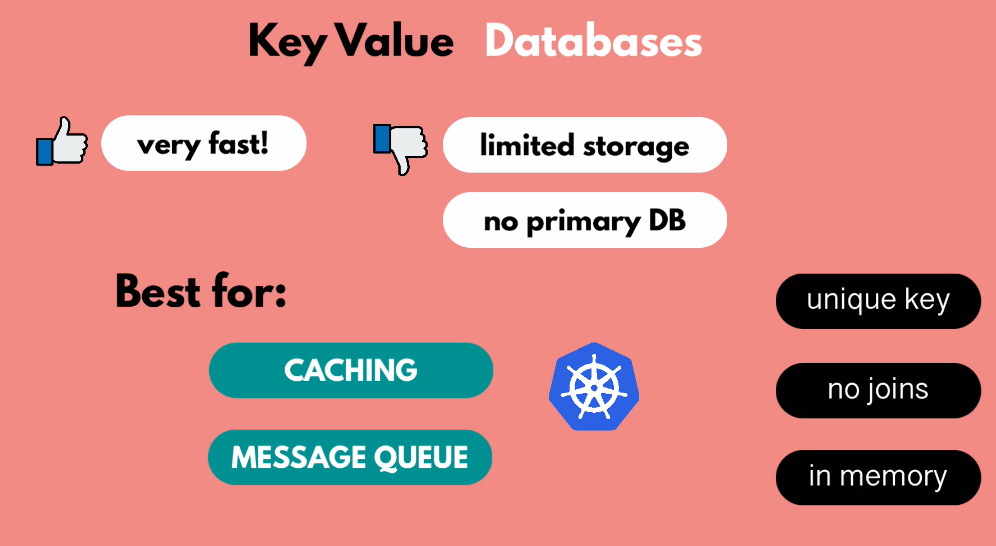
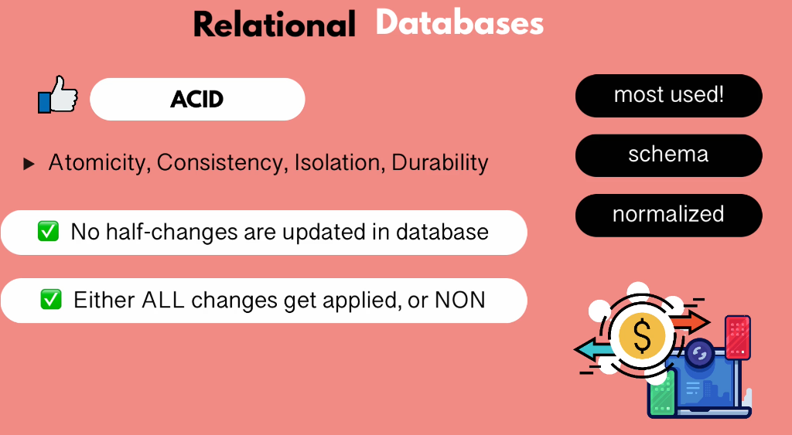

## Database Types

### 1- Key Value Database
1- Very Fast (store data in memeory)
2- Limited Storage due to memory
3- You can't use it as a primary database

### 2- Wide Column Database

1- Examples are cassandra, Apache Hbase
2- Unlike Relational Database, it doesn't have predefined schema. So you can have any number of columns.
3- It is scalable and distributed across multiple servers.
4- No joins

### 3- Document Database
1- MongoDb, CouchDB
2- Schema-less
3- Faster to read if you have everything stored in a document
4- Slower to writes if you have very nested structure of document
5- it is used for mobile apps, games, CMS and most apps 

### 4- Relational Database
1- Mysql, postgres
2- you have to define schema upfront
3- Tables
4- Normalized to reduce duplication

ACID doesn't allow relational database to scale easily.