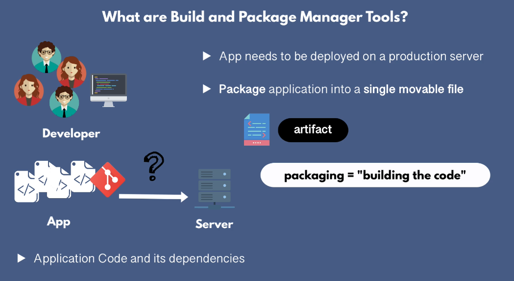
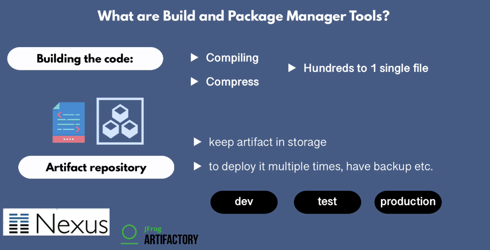

## Build and Package Manager Tools

When you are done in implementing application, Application must be made available to end user. Application needs to be deployed to production server. How do you deploy your application? How do you move application code and its dependencies to a server where application runs?

You package application into a moveable file also known as artifact.

The artifact should be stored in storage. We might need this specific to deploy it multiple environments (dev, test, production)

