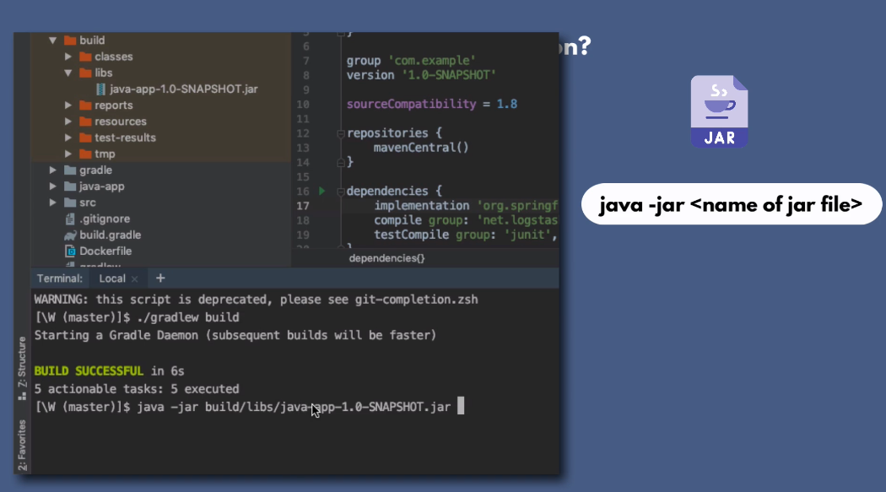
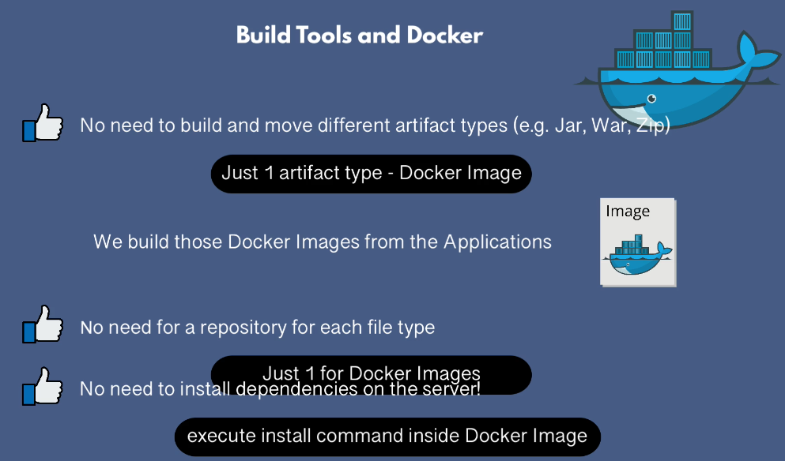

## Build Tools Installation and Configuration

### Install JDK from Oracle 

```https://www.oracle.com/java/technologies/downloads/#jdk21-windows```
```https://itsfoss.com/install-java-ubuntu/```

### Install IntelliJ

```https://www.jetbrains.com/idea/download/?section=windows```

### Install Maven bin archive

```https://maven.apache.org/download.cgi```

Build Maven Project command

```mvn package```

### Run Maven compiled application with jar



### Build Nodejs Application
```npm pack```

### Docker Build 
Docker Image is another artifact.
