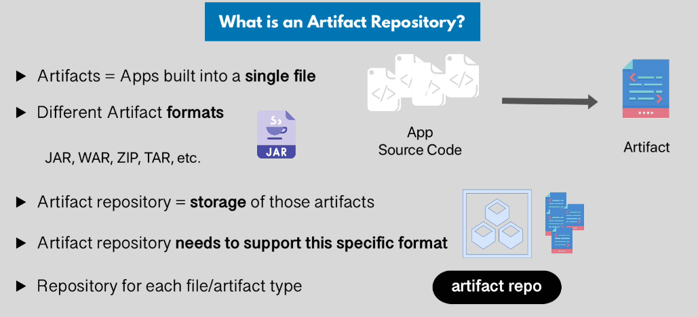
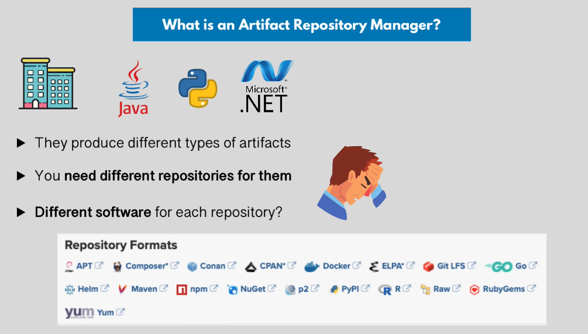
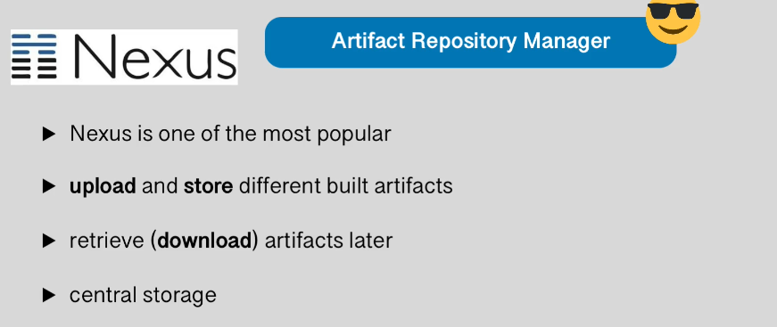
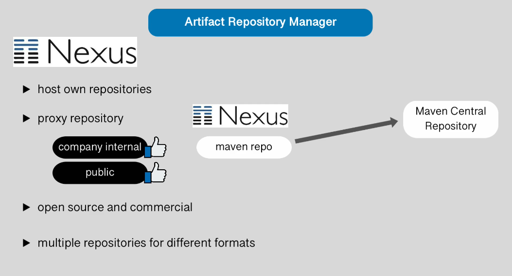
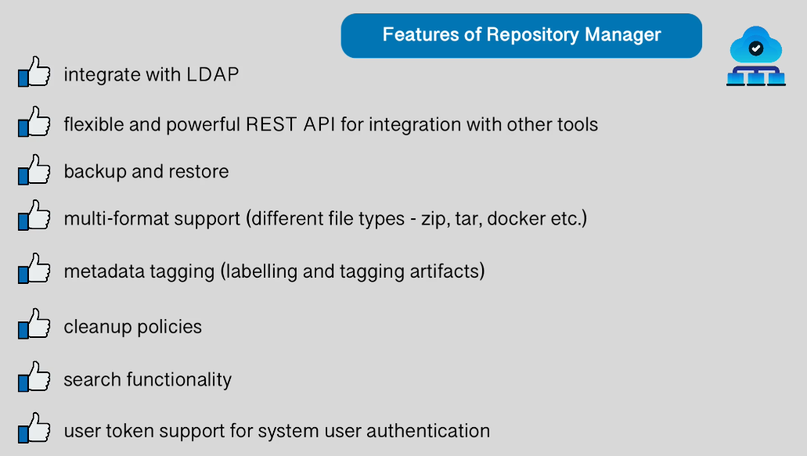

## Artifact Repository and Artifact Repository Manager

### Artifacts

Artifacts are applications built into a sinle, shareable and easily moveable file. It could have different formats such as JAR, WAR, ZIP, and TAR etc

Artifact Repositoy is where you store those artifacts.

### Why do we need a Artifact Repository Manager?

Applications built in different programming languages produce different types of artifacts. For that, you need different repositories to support artifact format. Imagine a situation where you had different Softwares to manage each of those repository format. Then you will end up with different softwares, one is managing a jar file and other is managing python and so on. 

The best and efficient way would be to have one application that would manage all these different types of artifact format. That application is a artifact repository Manager.

Nexus is a central storage of all those artifact types.

Nexus is used for internal in the organization. You also have public repository managers such as Meven Central Respository for Java and Npm Repository for Javascript.

You can make the public artifact (which is stored in meven public repository) available through nexus proxy repository.

