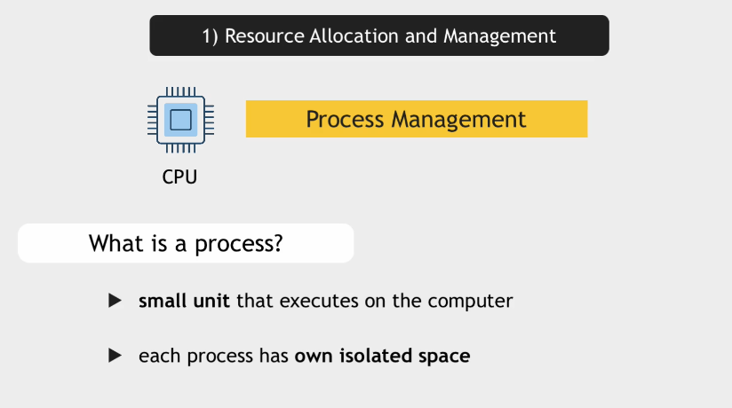

## Introduction to Operation System

Why do we need an operation system?

Our computer is made up of hardware components (Memory, storage, CPU, I/O devices such as mouse, keybord and monitor). Our programs need to use these hardware components in order to work properly. How to interact these hardware components?

We need a intermediary to talk to hardware components. This intermediary is a computer operating system.

### 1- Resource Allocation and Managment

OS is responsible for allocating and managing the hardware resources like CPU, memory etc

Every application needs a working memory (RAM) to start.

### 2- Manage File System

### 3- Management of I/O Devices

### 4- Security and Networking

## Operation System Components

When you power on the computer, the kernal of OS loads first. It manages the hardwares such as CPU, Memory etc. It also handles IO devices through device drivers. A driver is a code or program that lets the operating system and a device communicate with each other. 

