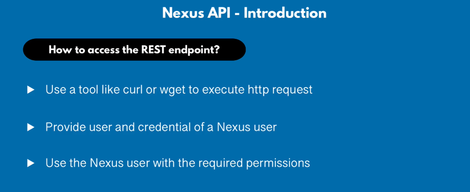
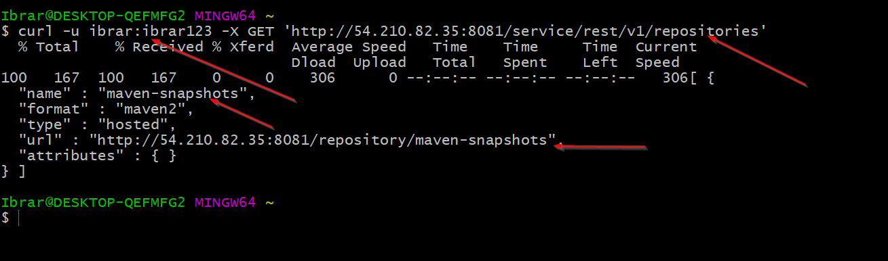
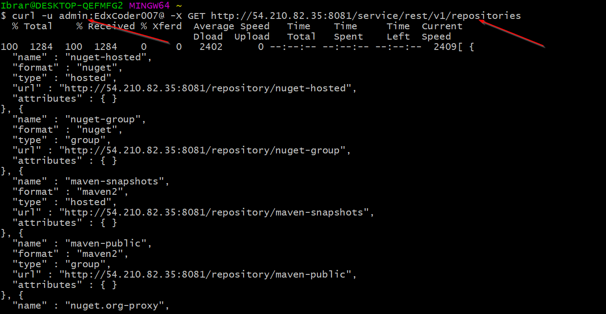
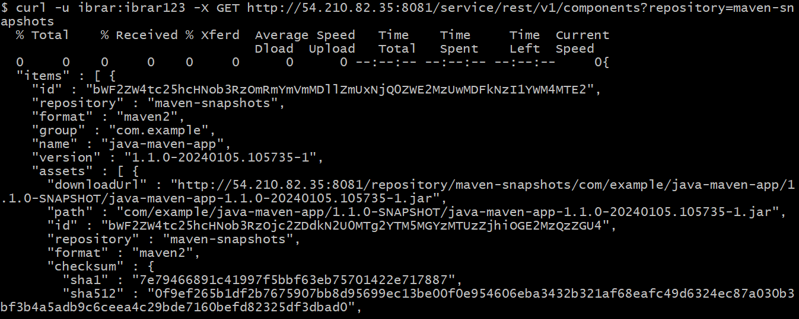

## Nexus API

We need nexus REST Endpoint in order to query nexus repository for different information like which components are available? What versions are avaibale? and which repositories are available?.



## List Repositories

```curl -u ibrar:ibrar123 -X GET http://54.210.82.35:8081/service/rest/v1/repositories```



This user is only allowed to view maven-snapshots repository just becuase of privileges.

## List Repositories with admin user
```curl -u admin:EdxCoder007@ -X GET http://54.210.82.35:8081/service/rest/v1/repositories```



Admin can view all the repositories.

## List components within repository

```curl -u ibrar:ibrar123 -X GET http://54.210.82.35:8081/service/rest/v1/components?repository=maven-snapshots```



## Get a component

```curl -u ibrar:ibrar123 -X GET http://54.210.82.35:8081/service/rest/v1/components/bWF2ZW4tc25hcHNob3RzOmRmYmVmMDllZmUxNjQ0ZWE2MzUwMDFkNzI1YWM4MTE2```