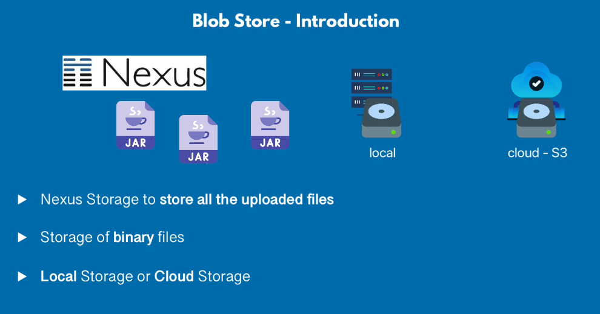
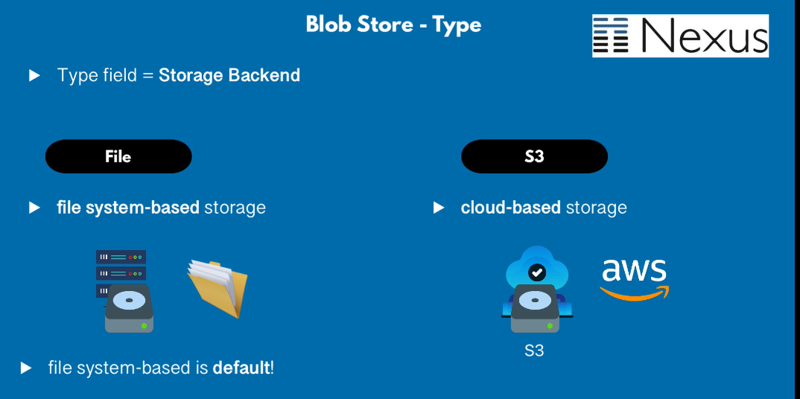
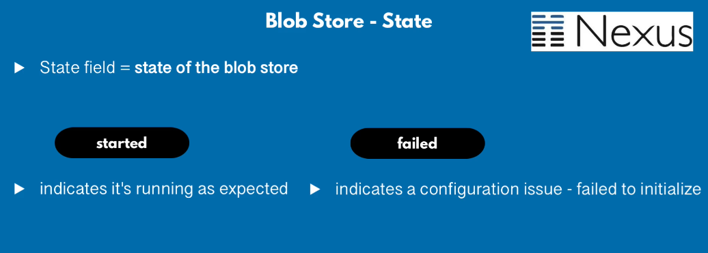
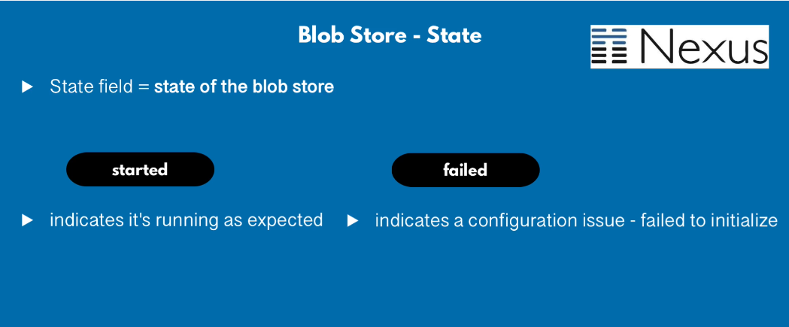
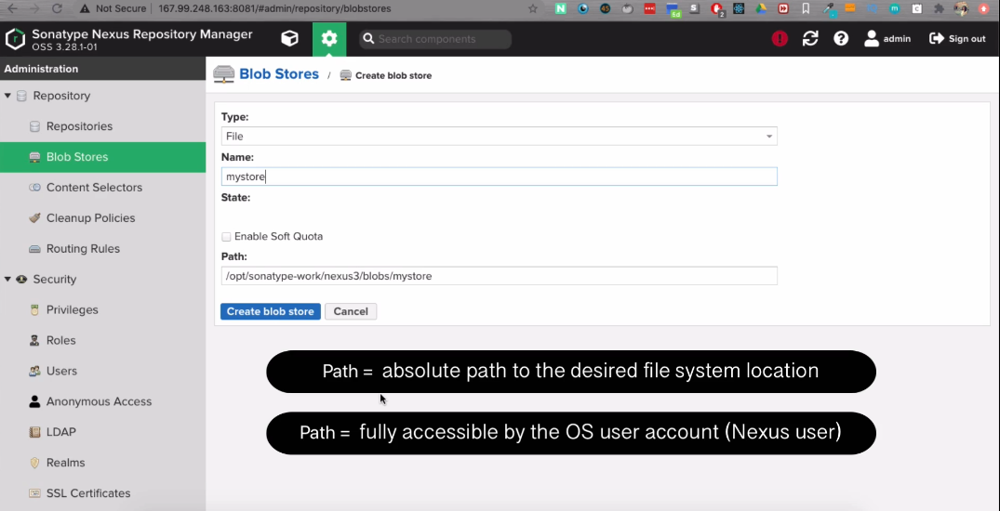
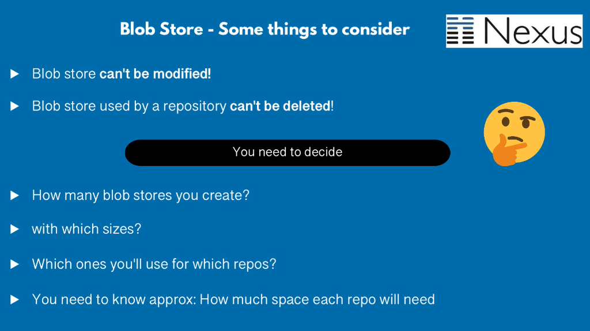
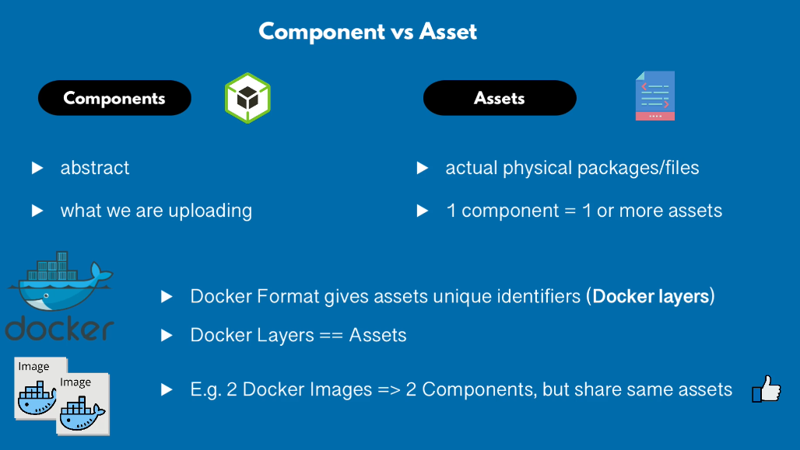

## Blob Store

Blob store is a internal storage mechanism for binary parts of artifact. Storage can be local and cloud storage. 

Each Blob store can be used by one or multiple repositories or event repository group.

## Components vs Assets

