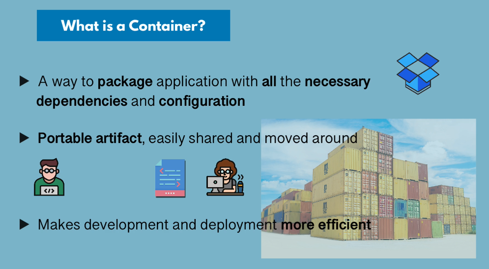
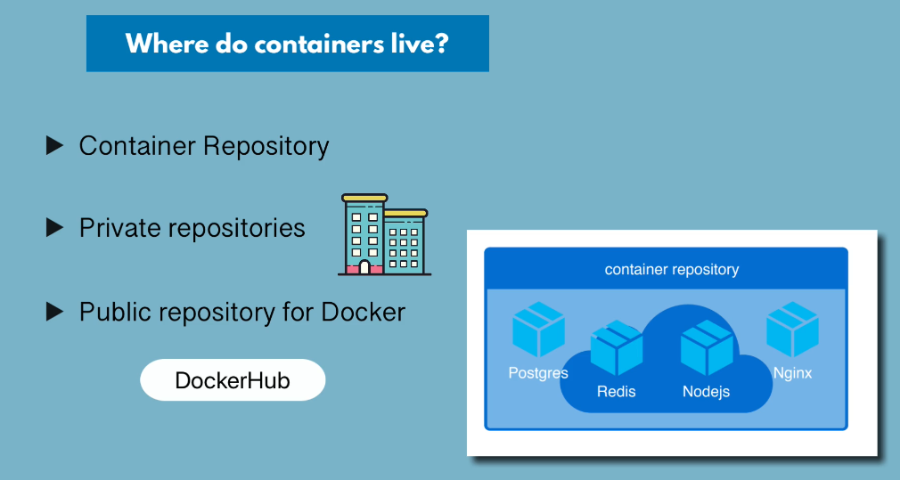
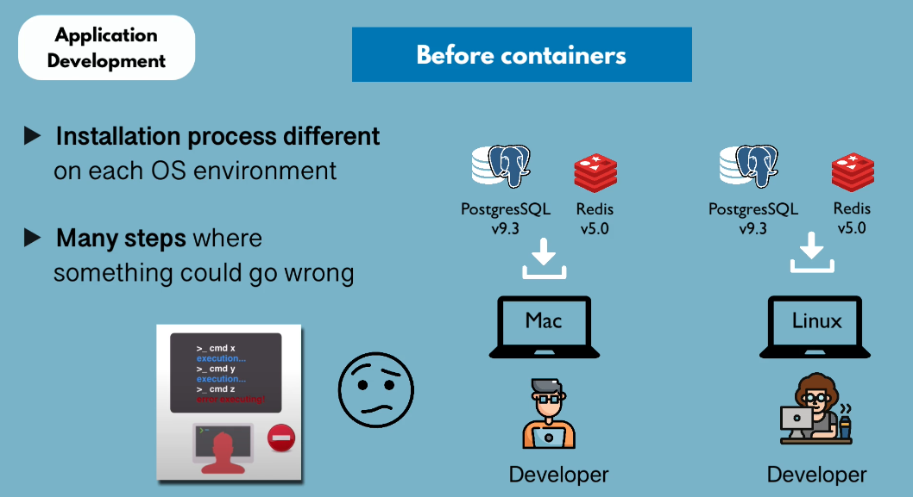
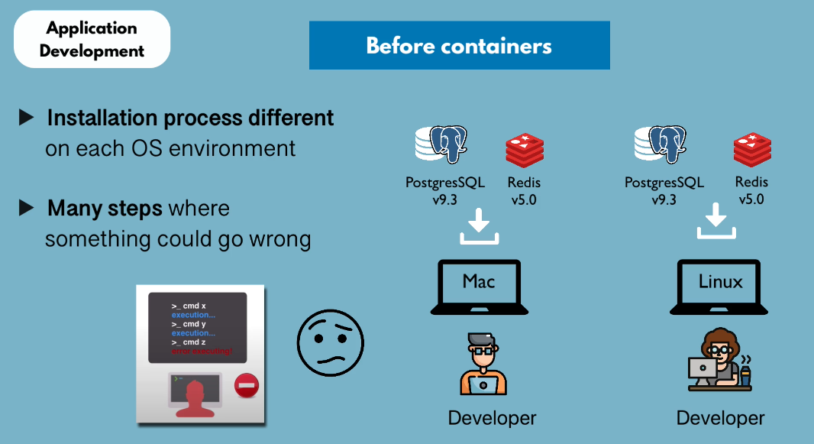
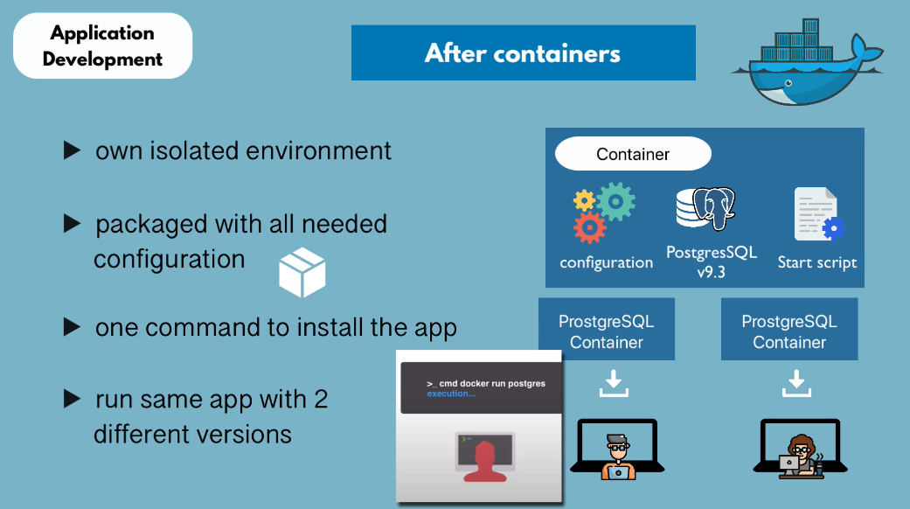
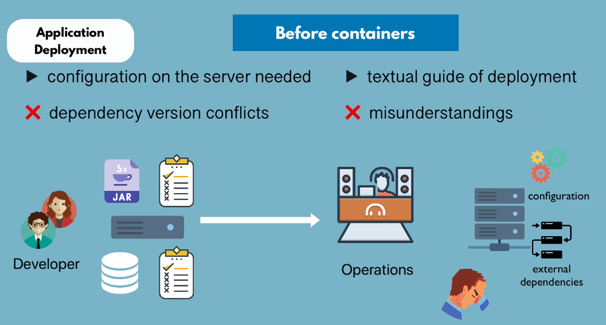

## Containers

A container is a way to package application with everything the application needs in order to run it including its dependencies, code and configuration.

Containers are portable. They can be moved around between development team or development and operations team.

## How containers improve application development process

The chances of something going wrong and error happening is pretty high becuase of the numbers steps require to install each service. This process of setting up new environment, let's say setting up 100 computers, can be pretty tedious depending on how complex your application is.   

## After Containers

Container can be considered as isolated environment.

With containers, you don't directly install softwares on your operating system. Containers have their own operating system with linux based image. One command to install and run container whether you are using linux and windows.

Also, you can have different versions of the same application running on your local environments without having any conflicts. 

## Improve Application Deployment

