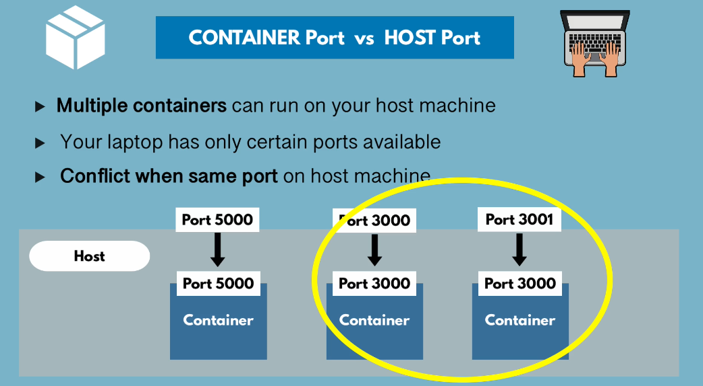
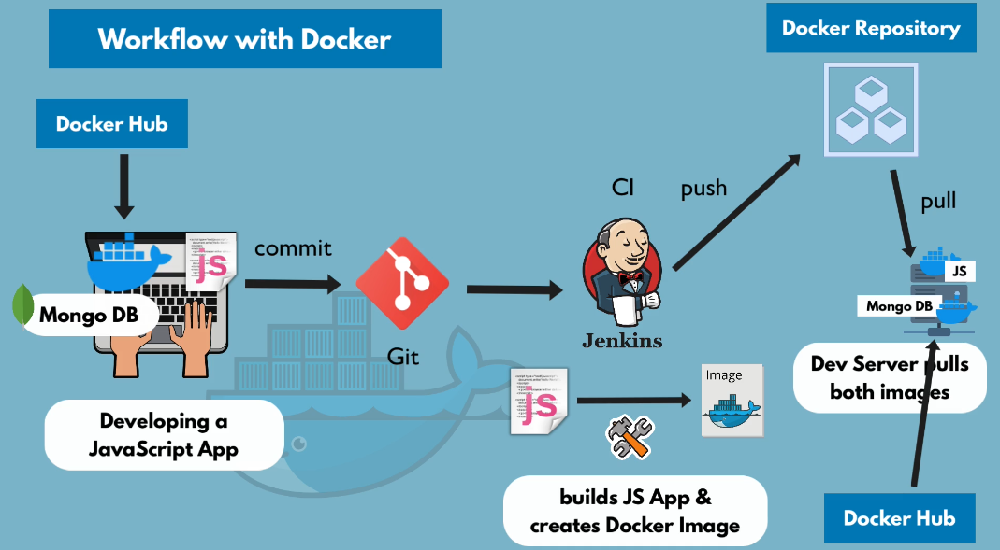

## Main docker Commands

list docker containers
```docker ps```

Start the container with detach mode
```docker run -d redis```

if you want to restart the container due to some issues

[[docker stop {container-id}]]
```docker stop 35364As```

[[docker start {container-id}]]
```docker start 35364As```

list running and stopped container
```docker ps -a```



docker port binding

```docker run -p6000:6579 redis```

## Docker Debug commands

display container logs either using container id or container name

```docker logs [[conatiner-id]]```
```docker logs [[conatiner-name]]```

name the conatiner while starting the container

```docker run -d -p6000:6379 --name redis-server redis```

get container terminal with exec command either using container id and name

```docker exec -it 345647As /bin/bash```

## Docker workflow in real world

