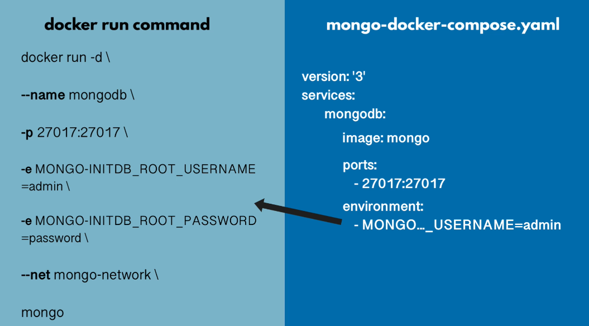
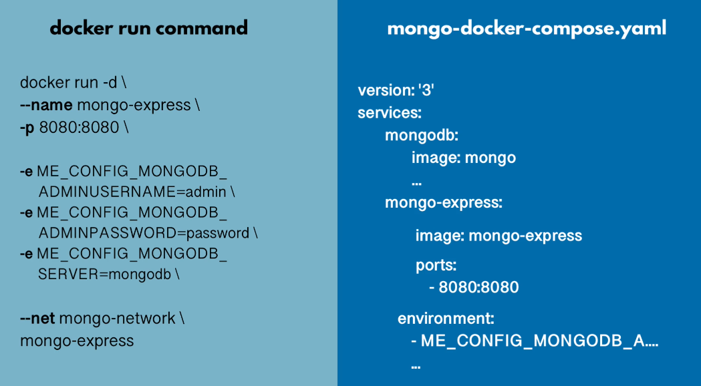
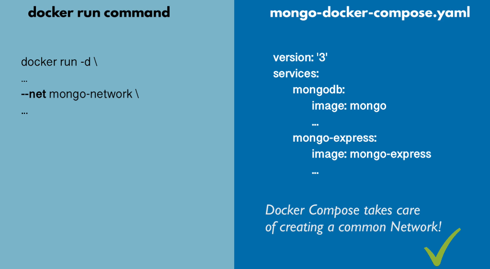
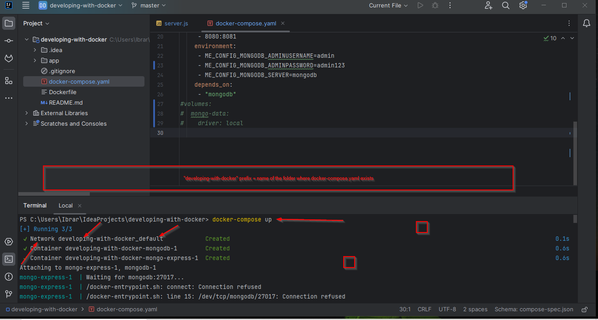
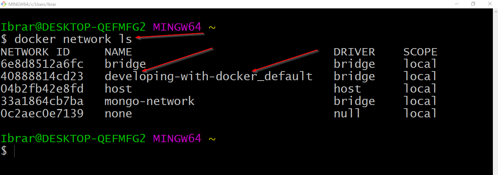
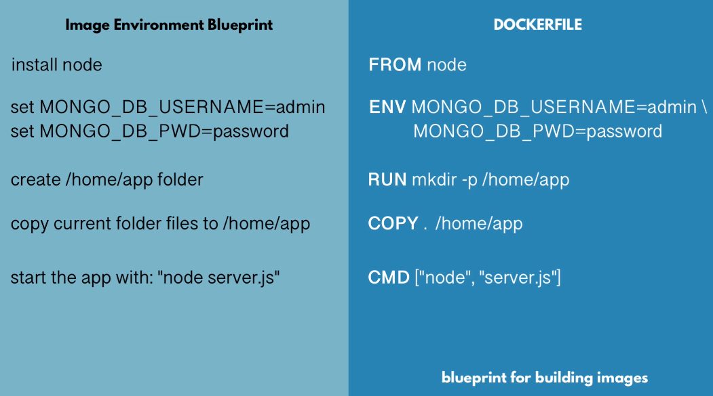

## Docker Compose

Run multiple containers with declarative way








## Dockerfile



```yml
FROM node:13-alpine

ENV MONGO_DB_USERNAME=admin \
    MONGO_DB_PWD=admin123

RUN mkdir -p /home/app

COPY ./app /home/app

# set default dir so that next commands executes in /home/app dir
WORKDIR /home/app

# will execute npm install in /home/app because of WORKDIR
RUN npm install

# no need for /home/app/server.js because of WORKDIR
CMD ["node", "server.js"]
```