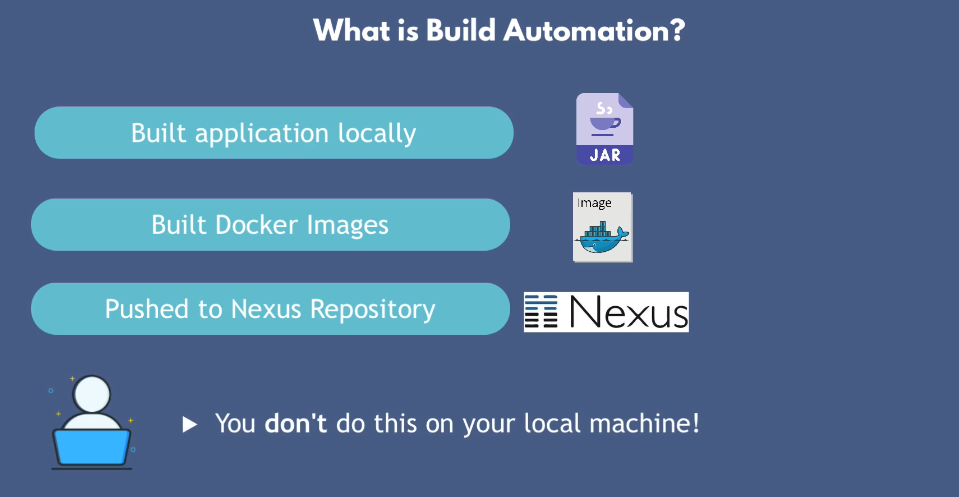
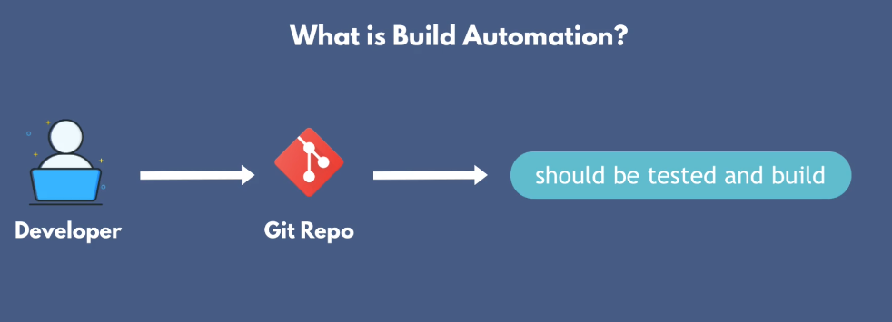
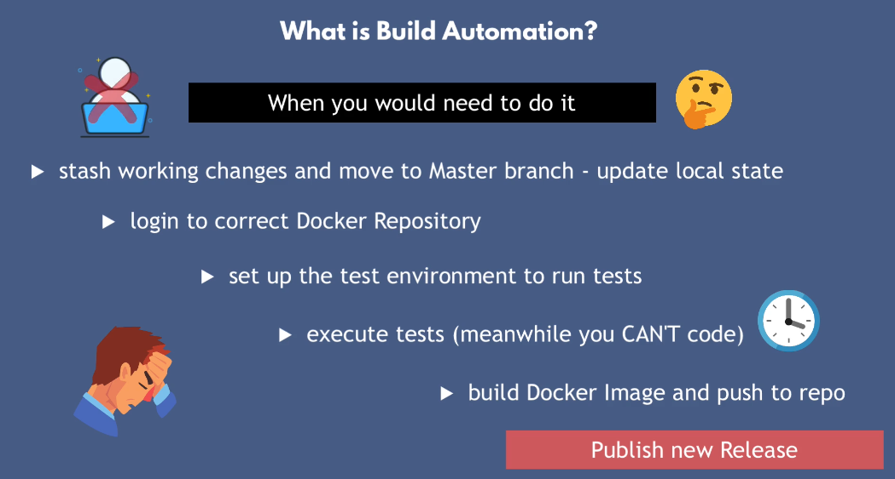
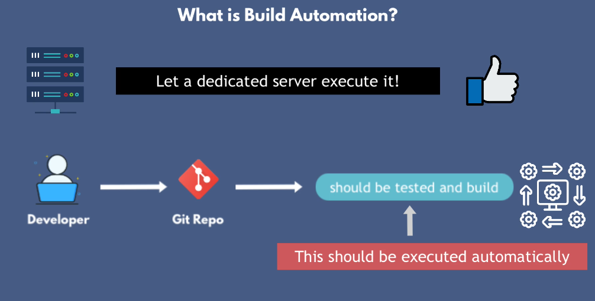
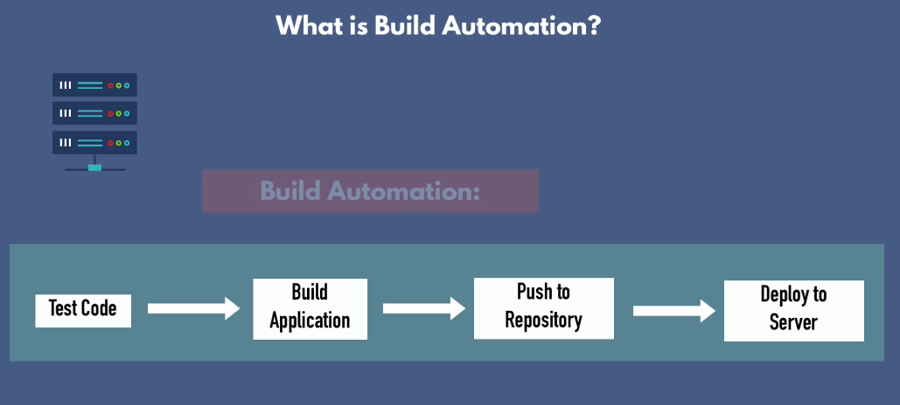
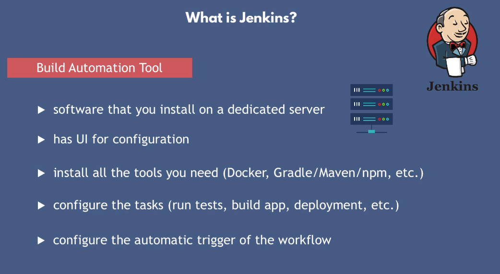
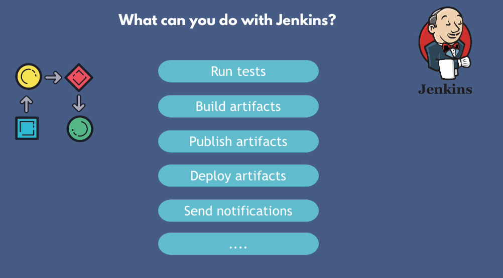
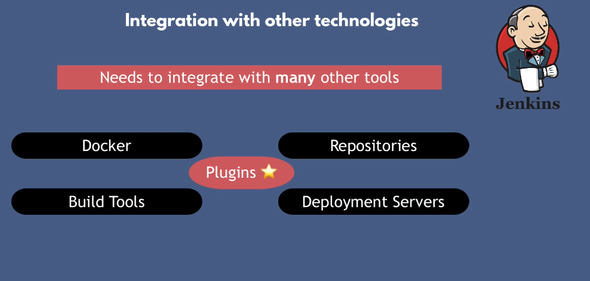
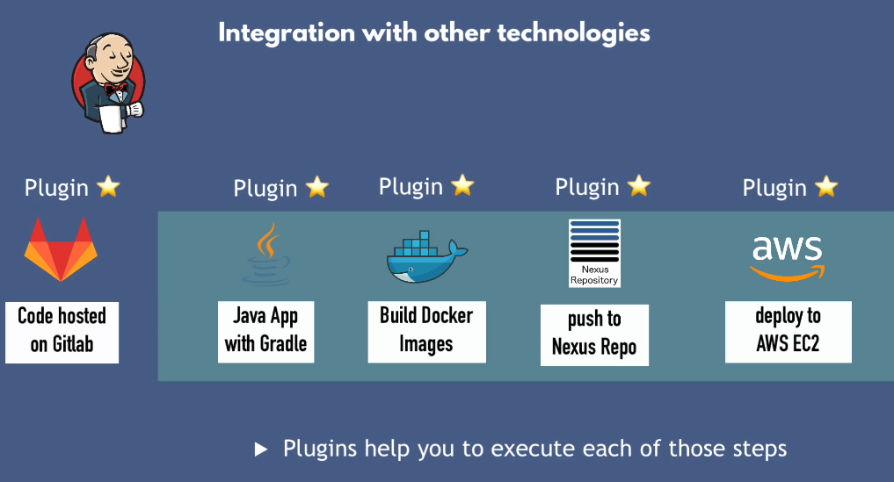
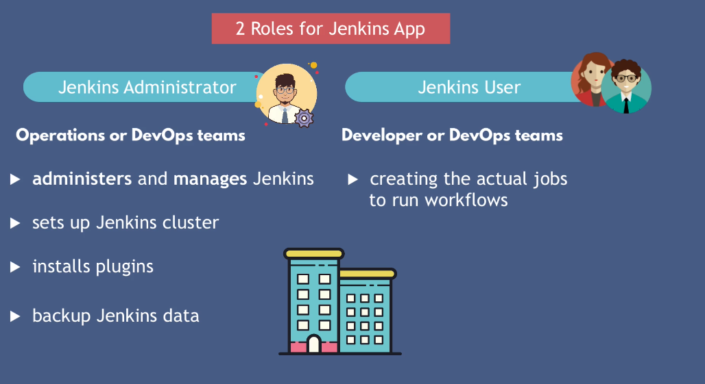

## Build Automation

Imagine a situation where developer had to do all of these like run the test, build the artifact and push to nexus repository locally on the machine.

if one of the developer in the team had to do every time you decide to release a new version, then the developer had to stop what he was doing and prepare the environments to do all these steps.

## Use dedicated Server

The process of automatically triggering the workflow that test your newly check in code, builds an application artifact and push it to repository and even deplpoy a new verison to server is called a build automation tool.

## Jenkins

Jenkin has a lot of plugins in order to certain tasks.

## Roles Concept:

