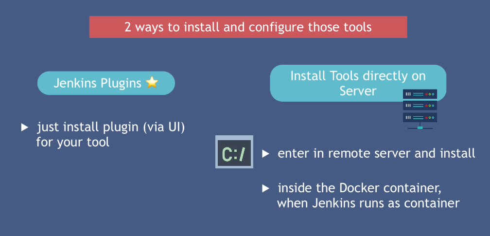
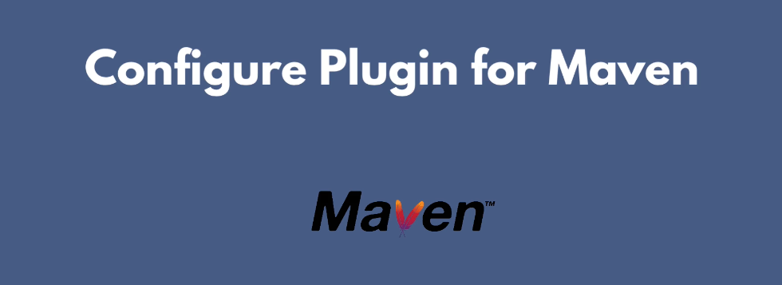
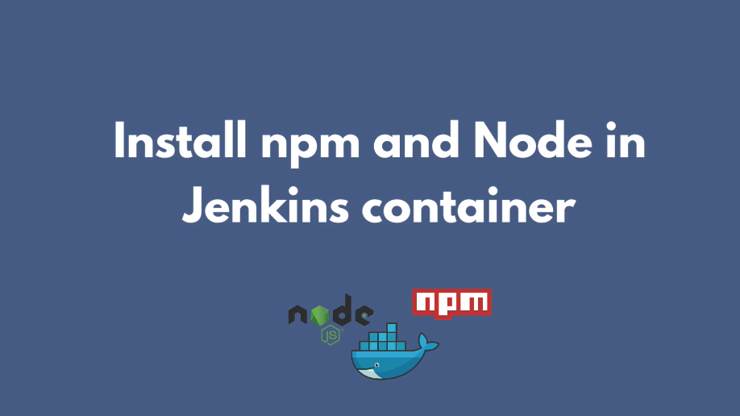
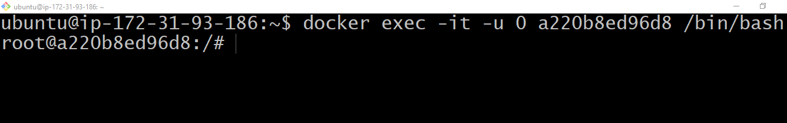
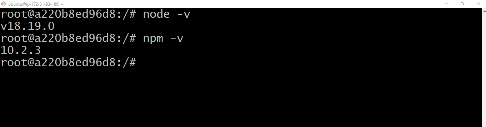

## Install Build Tools





By managing these tools or configuring these tools, i mean, which version of respective tool you need? and Makes those tools available in your job. 

Let's configure Maven build tool

Go to the Manage Jenkins screen and under system configuration, go to the Tools.

## 2- Install tools directly on the server jenkins running



Enter in the jenkins container as a root user by using the following command

```docker exec -it [[container-id]] -u 0 /bin/bash```




```bash
apt update -y
apt install curl
curl -fsSL https://deb.nodesource.com/setup_18.x | bash
apt install -y nodejs
```

