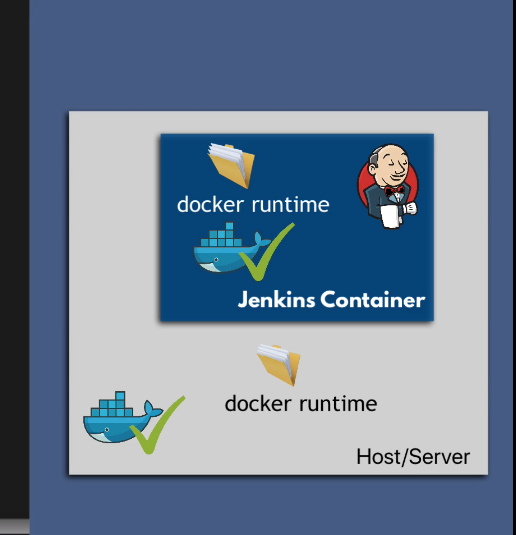

## Docker in Jenkins

First, we need to mount host file system location where docker runtime is installed into docker virtual file system to make docker available in jenkins job.



## What is the purpose of the file "docker.sock"?

it basically exposes the host docker daemon to the container. so you can invoke docker api/client from your container, to start/stop/build images/containers like directly calling those commands on the host.

Start the docker conatiner with this updated command

```bash
docker run -p 8080:8080 -p 50000:50000 -d -v jenkins_home:/var/jenkins_home -v /var/run/docker.sock:/var/run/docker.sock -v $(which docker):/usr/bin/docker jenkins/jenkins:lts-jdk17
```

Now, we need to fix the permission issue. We need to change docker.sock file permissions inside jenkins container.

```bash
chmod 666 /var/run/docker.sock
```


## Bind Credientials Plugin in free style job


These variables (USERNAME and PASSWORD) will be available in the whole build as an environment variables.


