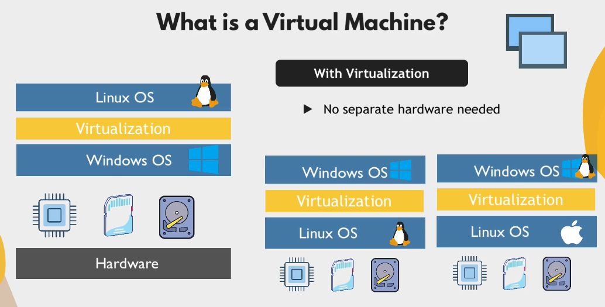
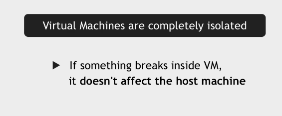
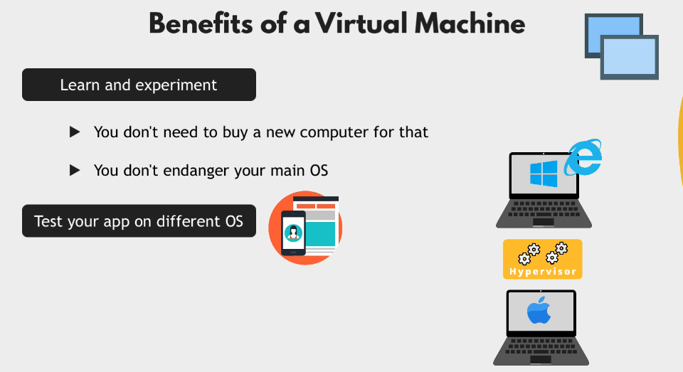
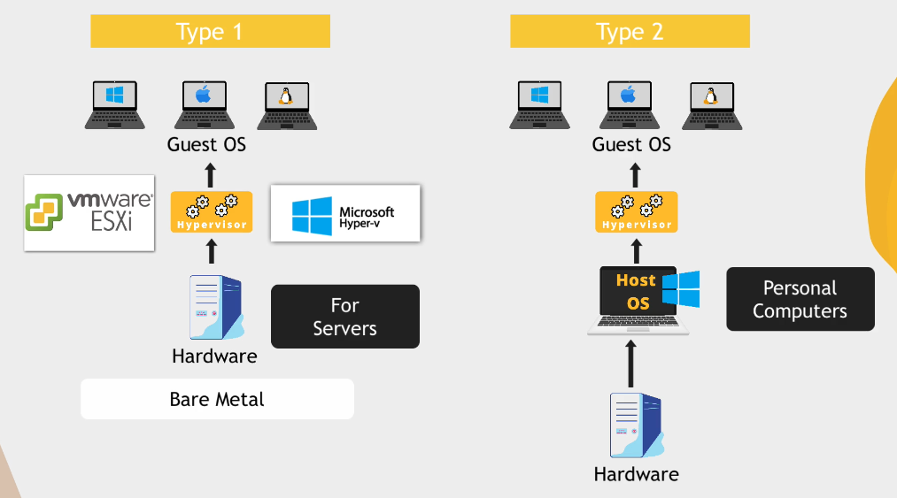
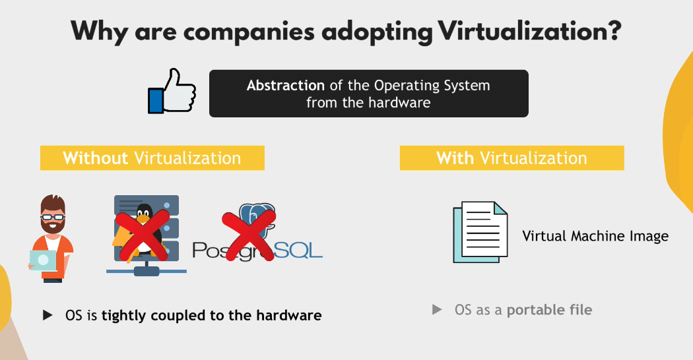

## What is virtual machine and virtualization?

Virtualization uses software called hypervisors to create multiple virtual computers (known as virtual machines or VMs) on a single physical machine. These virtual machines can access all the parts of the physical machine, including the computer’s brain or processors, memory and storage.

### Benefit of having Virtual machines

<strong>Type 1 hypervisors</strong>. A Type 1 hypervisor runs directly on a computer’s hardware, functioning as its own operating system. They’re commonly used in enterprise environments.
<strong>Type 2 hypervisors</strong>. A Type 2 hypervisor is installed on a computer’s operating system, just like any other software. They’re usually seen in individual computing environments.

#### Main use case of Type 1 Hypervisor
- Efficient usage of Hardware resources

#### Why are companies adopting virtualization?
