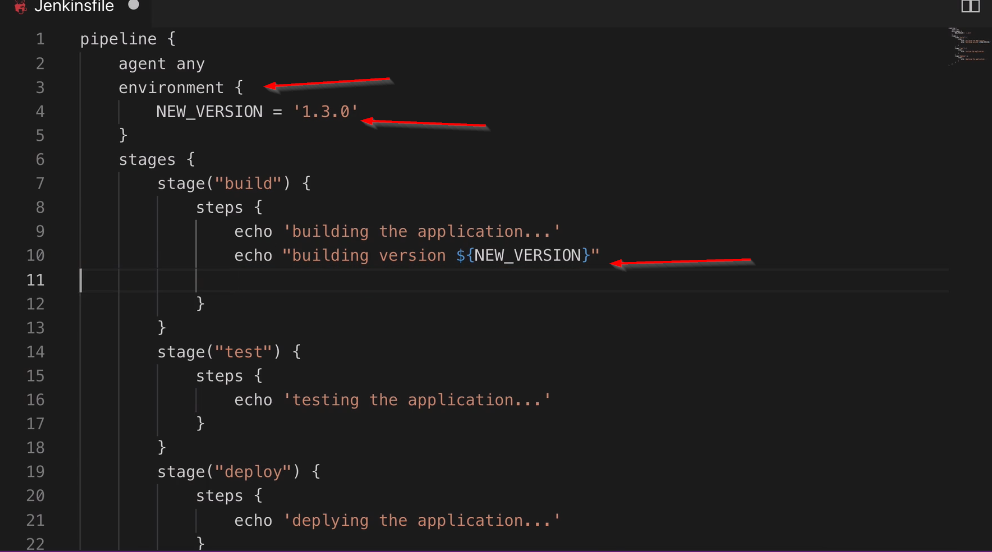
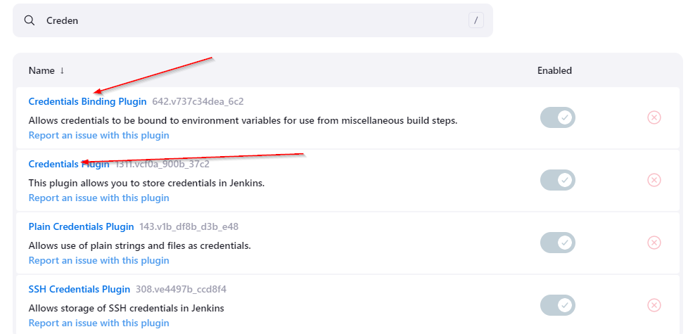

## Jenkins Pipeline


Groovy sandbox allows you to execute whitelisted functions withount any admin approval.


## Pipeline Syntax


## Post Attribute


## Define Conditions


```groovy
stages {

        stage("test") {
            when {
                expression {
                    BRANCH_NAME == 'dev' || BRANCH_NAME == 'master'
                    // env.BRANCH_NAME == 'dev' || env.BRANCH_NAME == 'master'
                }
            }
            steps {
                echo "Testing the application"
            }
        }
}
```

## Environment Variables


```http://18.204.205.100:8080/env-vars.html/```

## Define ENV variables for all stages



## Using Jenkins Credientials as ENV variables


## Define credentials in a specific stage using withcredentials

```groovy
     stage("build") { 
            
            steps {
                echo "building the application"
                echo "building version ${NEW_VERSION}"
                withCredentials([
                    usernamePassword(credentialsId: 'docker-hub-repo', usernameVariable: 'USER', passwordVariable: 'PWD')
                ]){
                    sh "echo some script ${USER} ${PWD}"
                }
            }
        }
```

Make sure you have these plugins installed to use credentials



## Access build tools in your jobs


## Parameters in build


## External Groovy Script


## Input Parameters from user in a stage


Expose only one input parameter to whole stages using environment variables inside script block


```groovy
pipeline {

    agent any

    tools {
        maven 'maven-3.9'
    }

    environment {
        NEW_VERSION = '1.1.0'
  
    }

    stages {

        stage("test") {
            when {
                expression {
               
                     env.BRANCH_NAME == 'dev' || env.BRANCH_NAME == 'master'
                }
            }
            steps {
                echo "Testing the application"
            }
        }

        stage("build") { 
            
            steps {
                echo "building the application"
                echo "building version ${NEW_VERSION}"
                withCredentials([
                    usernamePassword(credentialsId: 'docker-hub-repo', usernameVariable: 'USER', passwordVariable: 'PWD')
                ]){
                    sh "echo some script ${USER} ${PWD}"
                }
            }
        }

        stage("deploy") {
            input {
                message "Select the environment to deploy"
                ok "Done"
                parameters {
                    choice(name: 'ENV', choices: ['dev', 'prod', 'test'], description:'')
                }
            }
            
            steps {
                echo "Deploying the application"
            }
        }
    }

    // post {
    //     always {

    //     }
    //     success {

    //     }
    //     failure {

    //     }
    // }
}
```

