## Jenkins Credentials

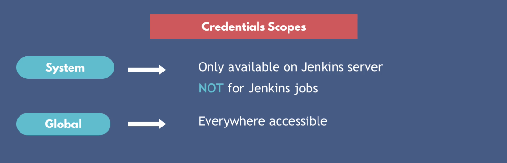

## Third Credentials Scope is multibranch pipeline


We can separate credentials between projects using multi-branhc pipeline credientials.

## What is Jenkins Shared Library? Why we need it?

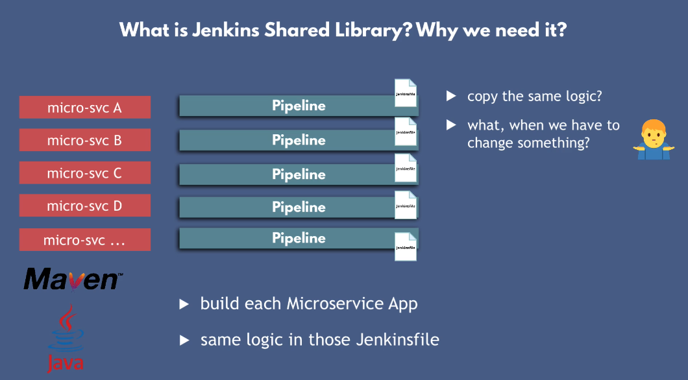


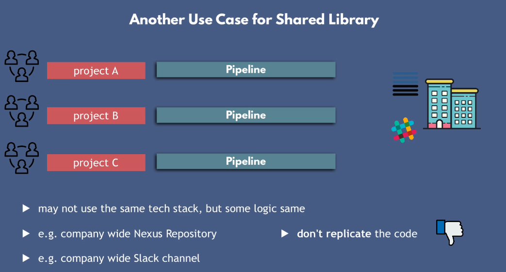

## Steps to create shared library

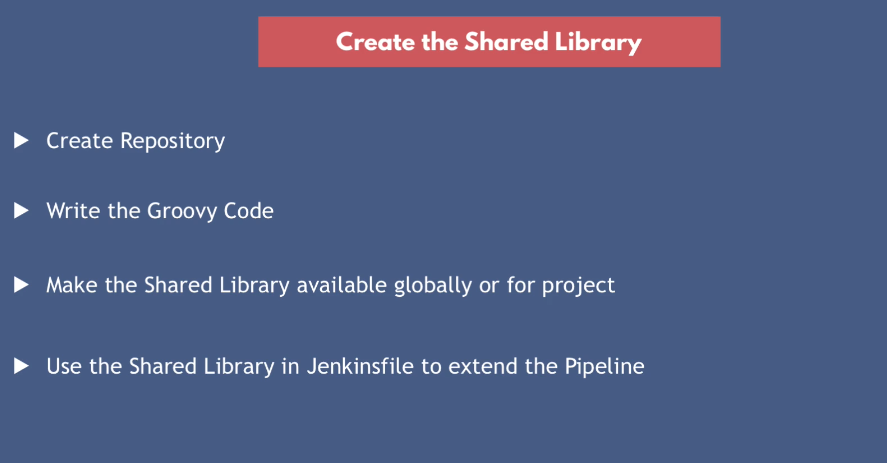

## Jenkins Shared Library structure

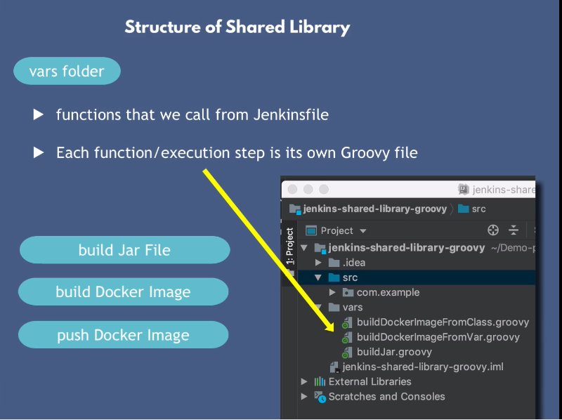
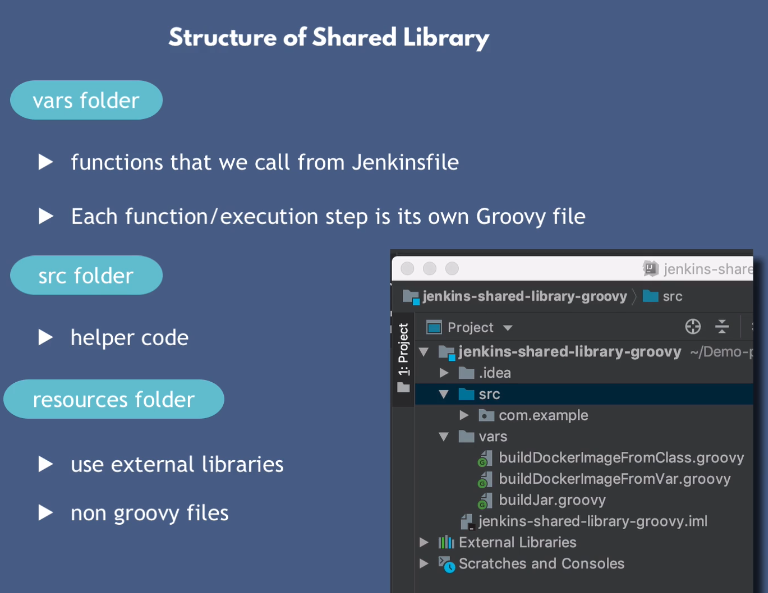

When you reference function from jenkins shared library into a job, you will reference it by function name.

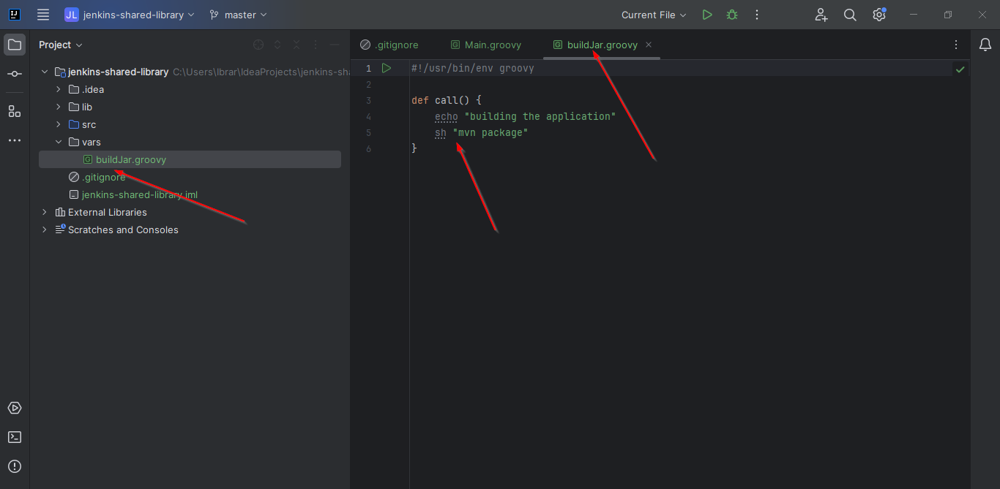


## Use Jenkins Library in Jenkins

1- Go inside manage jenkins and click on systems

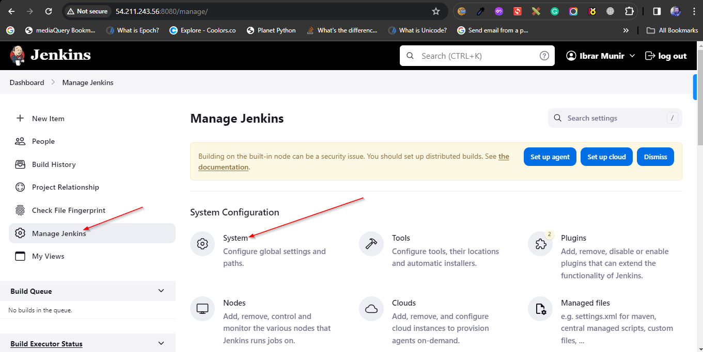

2- Find the Global pipeline libraries Section

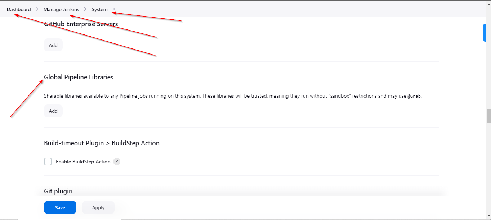

3- Add a name and in the default version, you could either add branch name or specific commit hash.

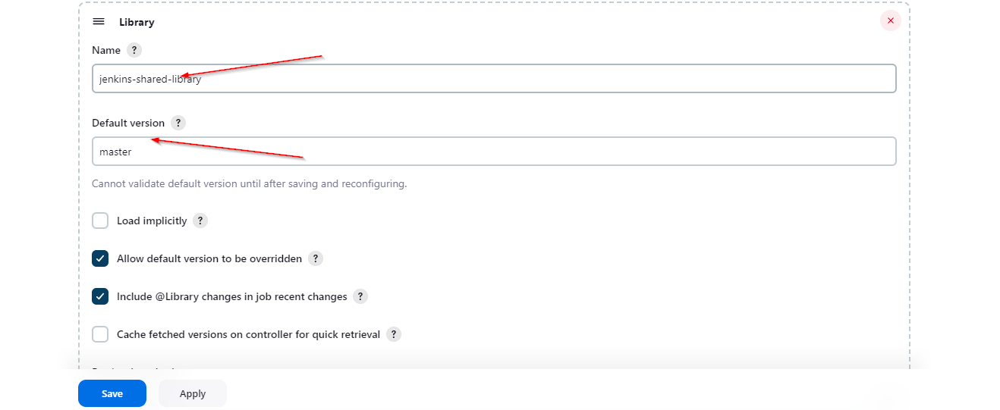

4- Add Repository Details and credentials

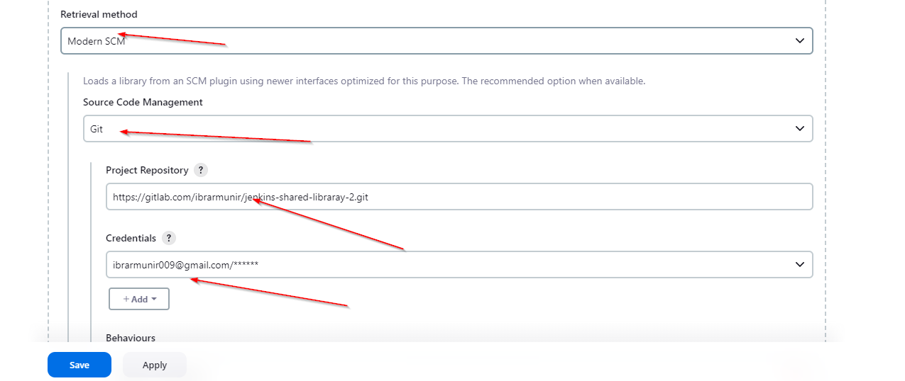

5- Usage in jenkinsfile

```groovy
@Library('jenkins-shared-library')_
def gv

pipeline {

    agent any

    tools {
        maven 'maven-3.9'
    }

    stages {

        stage("init") {
            steps {
                script {
                    gv = load "script.groovy"
                }
            }
        }

        stage("build jar") {
            steps {
                script {
                    buildJar()
                }
            }
        }

        stage("build image") { 
            steps {
                script {
                    buildImage()
                }
            }
        }

        stage("Deploy") {
            steps {
                script {
                    gv.deployApp()
                }
            }
        }
    }
}

```

6- Let's parameterize our build image function

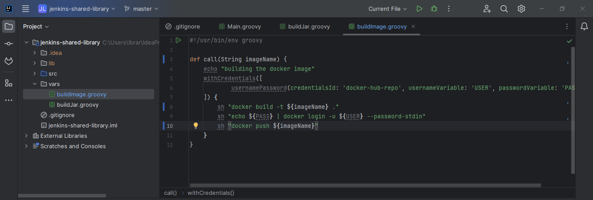
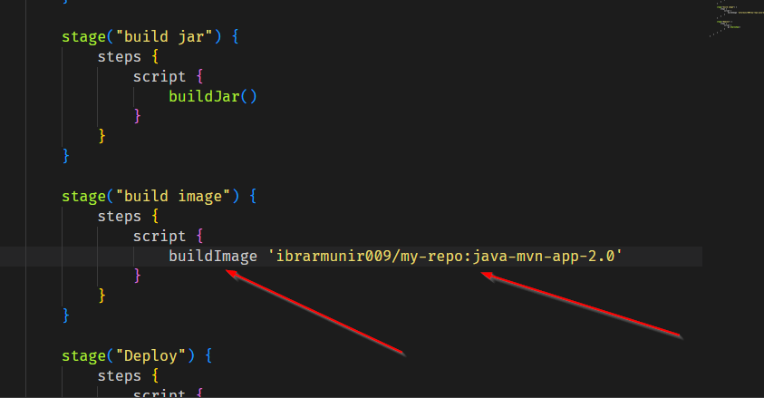

7- We can also global Env variables in groovy shared script

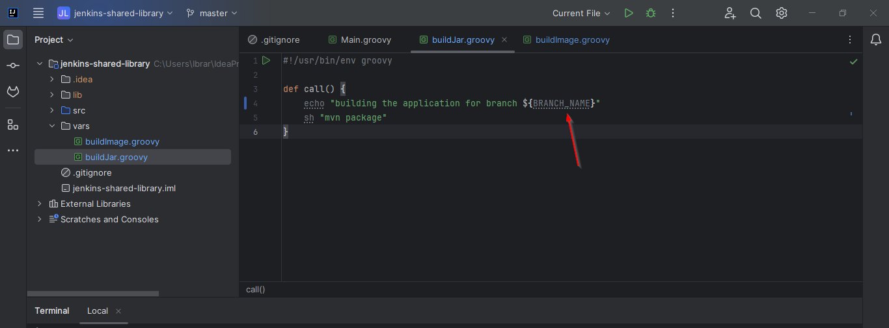

## Instead adding global pipeline libraries, we can also define and reference the shared library within Jenkinsfile which is only available for this pipeline job.

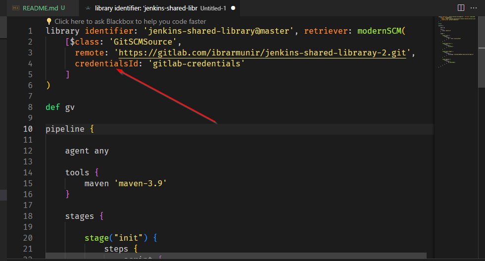

