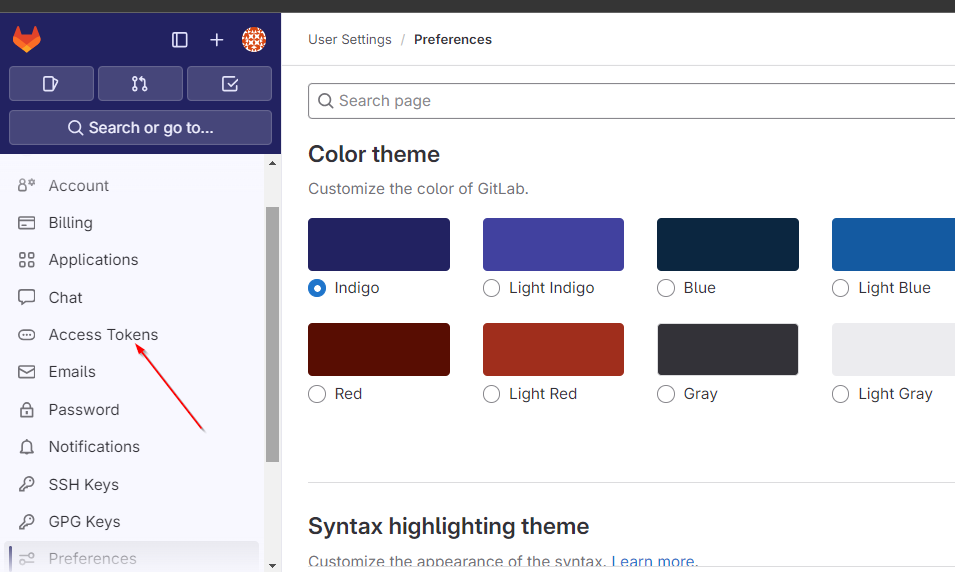
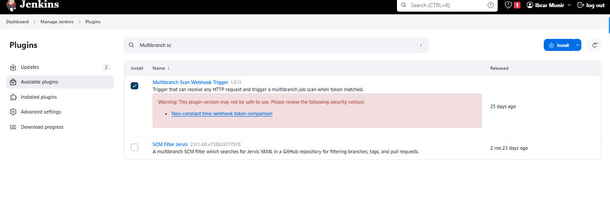

## Jenkins Webhhoks


## Configure automatic triggering of build for pipeline

Install the gitlab plugin


Once the plugin is installed, navigate to system configuration tab


Generate a token on gitlab which is required while setting a API Toke Credentials in jenkins

Go to user preferences


In the left sidebar, click on the access tokens




Setup jenkins API Token type credentials by clicking on add button


Now, we need to configure webhook on gitlab repository to automatically sent notification to jenkins whenever the change is made on that repository.

Click on repo settings and under settings click on integrations


Scroll down and look for Jenkins


Now, configure pipeline job to accept connection from jenkins. click on configure from left sidebar inside the pipeline job


1- Install Plugin for that



2- Navigate to multi branch pipeline configure tab


We will use this string "gitlabtoken" inside the gitlab webook configuration for a specific repository. This token could be any name.

3- Click on webhooks under settings of a repository.


```http://54.211.234.168:8080/multibranch-webhook-trigger/invoke?token=gitlabtoken```


