## Deploy to EC2 from Jenkins Server CI/CD

We are going to add deploy in our pipeline that we created in previous module.

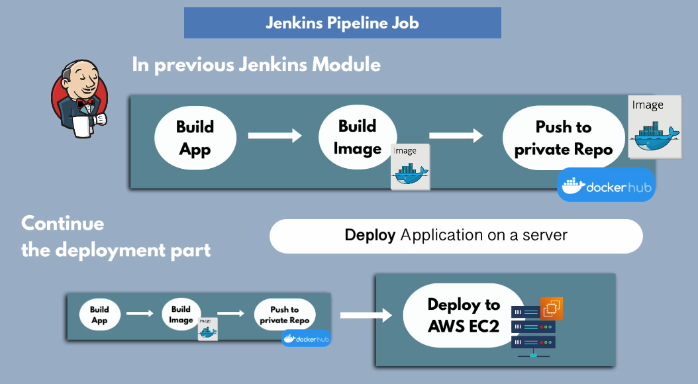
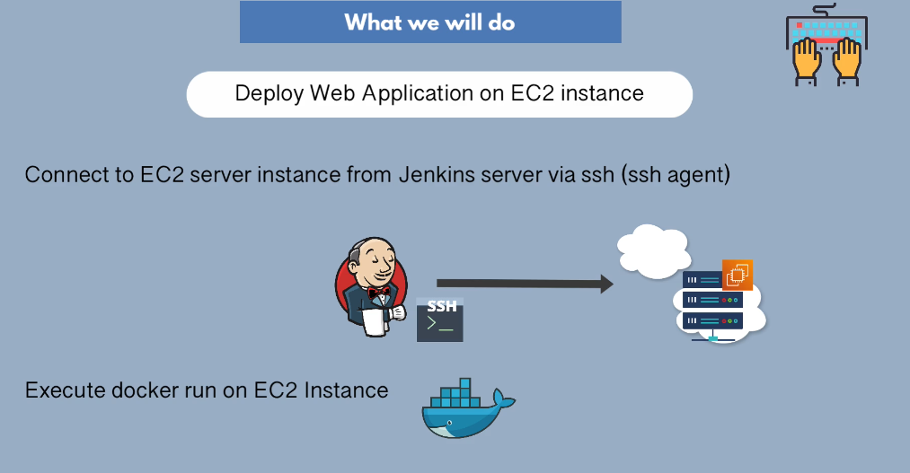

Install Ssh agent plugin

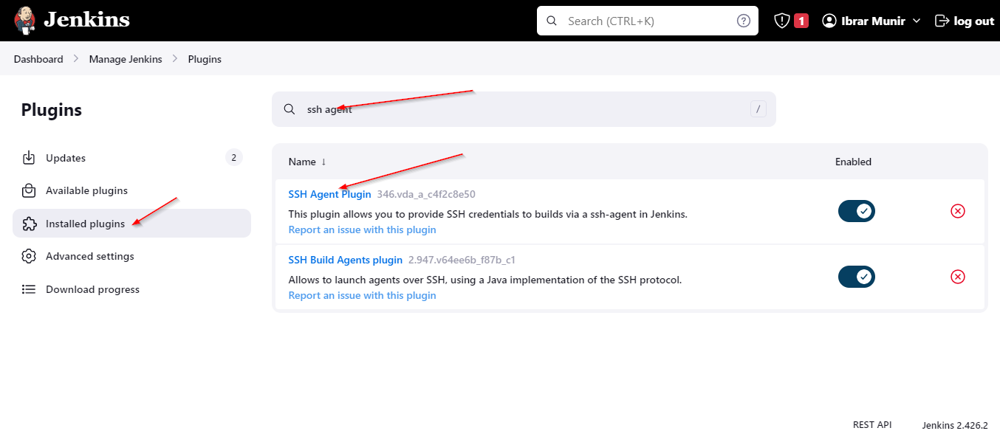

Add a ssh private key type credentials in multibranch pipeline scope.

Click on credentials from inside the mlutibranch pipeline.

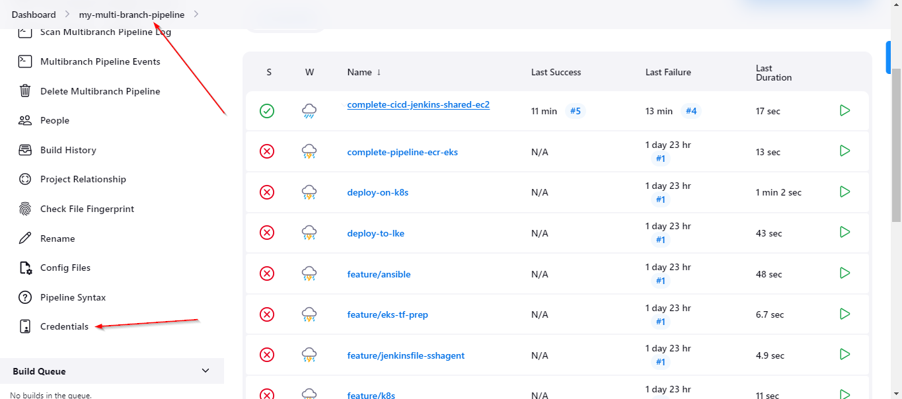

Create credentials within the multibranch pipeline scope.

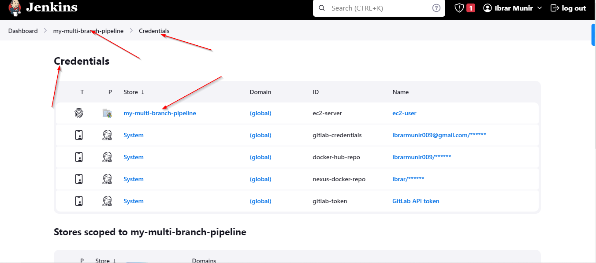
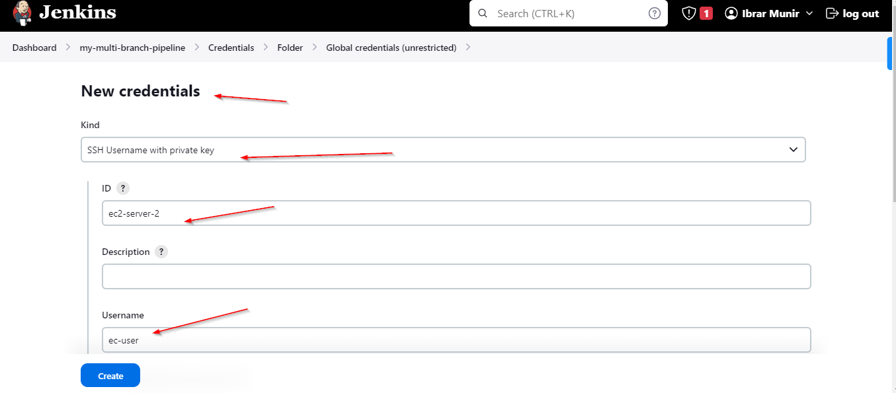


## Command to install docker on amazon linux 2023

```bash
sudo yum install -y docker
sudo service docker start
```

## StrickHostKeyChecking

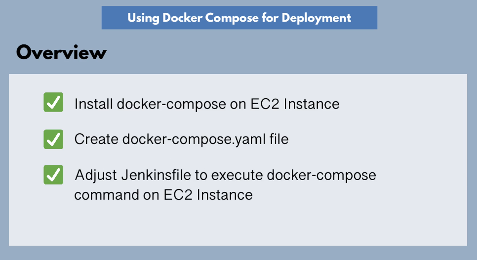

### Allow Jenkins IP on EC2 Security Group

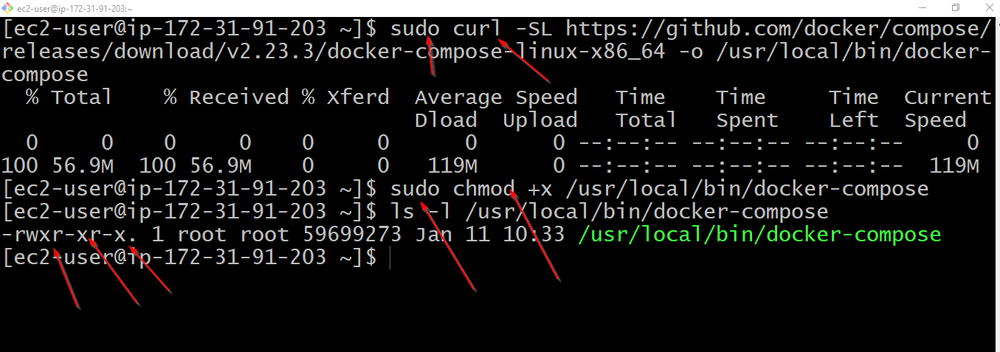


### Jenkinsfile

```groovy
//@Library('jenkins-shared-library')_

library identifier: 'jenkins-shared-library@master', retriever: modernSCM(
    [$class: 'GitSCMSource',
      remote: 'https://gitlab.com/ibrarmunir/jenkins-shared-libraray-2.git',
      credentialsId: 'gitlab-credentials' 
    ]
)

def gv

pipeline {

    agent any

    tools {
        maven 'maven-3.9'
    }

    environment{
        IMAGE_NAME = 'ibrarmunir009/my-repo:java-mvn-app-2.0'
    }

    stages {

        stage("init") {
            steps {
                script {
                    gv = load "script.groovy"
                }
            }
        }

        stage("build jar") {
            steps {
                script {
                    buildJar()
                }
            }
        }

        stage("build and push image") { 
            steps {
                script {
                    buildImage(env.IMAGE_NAME)
                    dockerLogin()
                    dockerPush (env.IMAGE_NAME)
                }
            }
        }

        stage("Deploy") {
            steps {
                script {
                    echo 'Deploying Docker image to EC2...'
                    def dockerCmd = "docker run -d -p 8080:8080 ${IMAGE_NAME}"
                    sshagent(['ec2-server']){
                        sh "ssh -o StrictHostKeyChecking=no ec2-user@34.227.31.125 ${dockerCmd}"
                    }
                }
            }
        }
    }
}
```

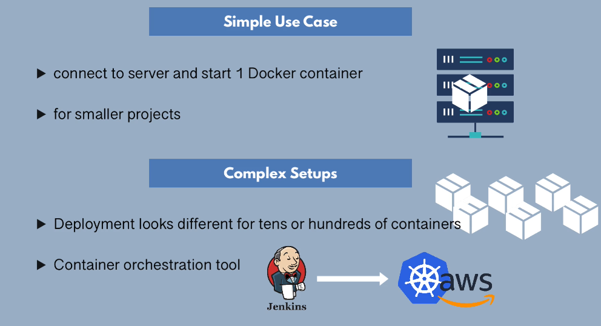

## Deploy Container using docker compose to start multiple services insread of running docke run command for individual


Install docker compose on ec2 server

```bash
sudo curl -SL https://github.com/docker/compose/releases/download/v2.23.3/docker-compose-linux-x86_64 -o /usr/local/bin/docker-compose
sudo chmod +x /usr/local/bin/docker-compose
```


Create docker-compose file

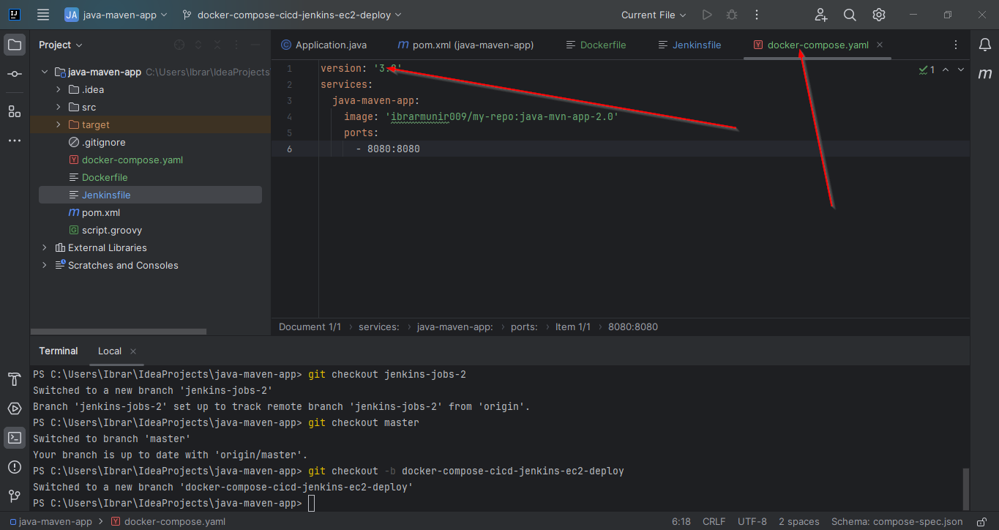

Make adjustment to jenkinsfile 

```groovy
//@Library('jenkins-shared-library')_

library identifier: 'jenkins-shared-library@master', retriever: modernSCM(
    [$class: 'GitSCMSource',
      remote: 'https://gitlab.com/ibrarmunir/jenkins-shared-libraray-2.git',
      credentialsId: 'gitlab-credentials'
    ]
)

def gv

pipeline {

    agent any

    tools {
        maven 'maven-3.9'
    }

    environment{
        IMAGE_NAME = 'ibrarmunir009/my-repo:java-mvn-app-1.0'
    }

    stages {

        stage("init") {
            steps {
                script {
                    gv = load "script.groovy"
                }
            }
        }

        stage("build jar") {
            steps {
                script {
                    buildJar()
                }
            }
        }

        stage("build and push image") {
            steps {
                script {
                    buildImage(env.IMAGE_NAME)
                    dockerLogin()
                    dockerPush (env.IMAGE_NAME)
                }
            }
        }

        stage("Deploy") {
            steps {
                script {
                    echo 'Deploying Docker image to EC2...'
                    def dockerComposeCmd = "docker-compose -f docker-compose.yaml up --detach"
                    sshagent(['ec2-server']){
                        sh "scp docker-compose.yaml ec2-user@34.227.31.125:/home/ec2-user"
                        sh "ssh -o StrictHostKeyChecking=no ec2-user@34.227.31.125 ${dockerComposeCmd}"
                    }
                }
            }
        }
    }
}

```


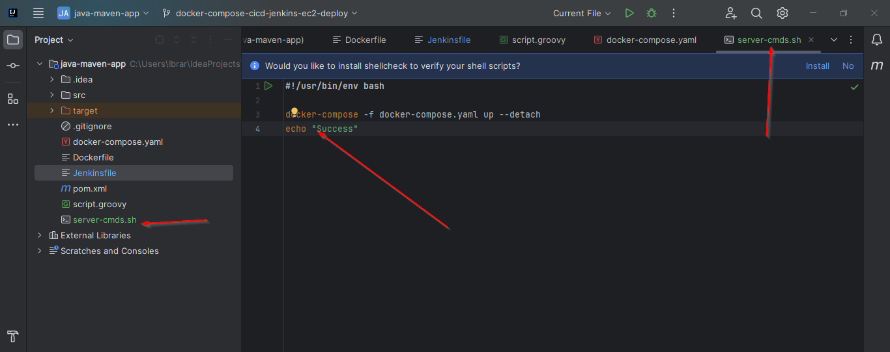

```groovy
stage("Deploy") {
            steps {
                script {
                    echo 'Deploying Docker image to EC2...'
                    def shellCmd = "bash ./server-cmds.sh"
                    sshagent(['ec2-server']){
                        sh "scp server-cmds.sh ec2-user@34.227.31.125:/home/ec2-user"
                        sh "scp docker-compose.yaml ec2-user@34.227.31.125:/home/ec2-user"
                        sh "ssh -o StrictHostKeyChecking=no ec2-user@34.227.31.125 ${shellCmd}"
                    }
                }
            }
        }
```

## Fix Dockercompose file image hardcoded


```yaml
version: '3.8'
services:
  java-maven-app:
    image: ${IMAGE}
#    image: 'ibrarmunir009/my-repo:java-mvn-app-1.0'
    ports:
      - 8080:8080
```

updated shell script

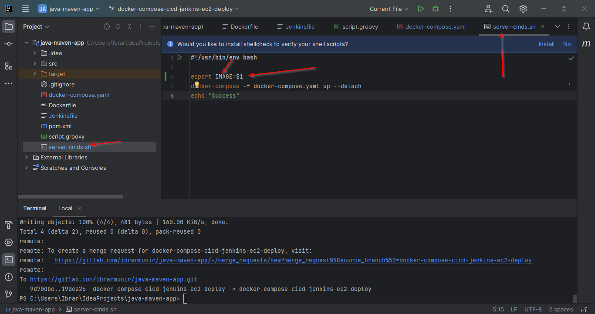

Make adjustment to jenkins file

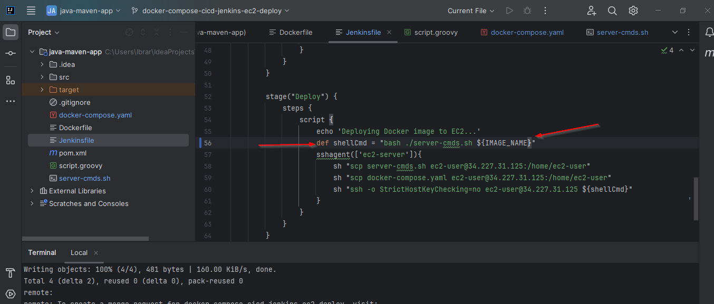