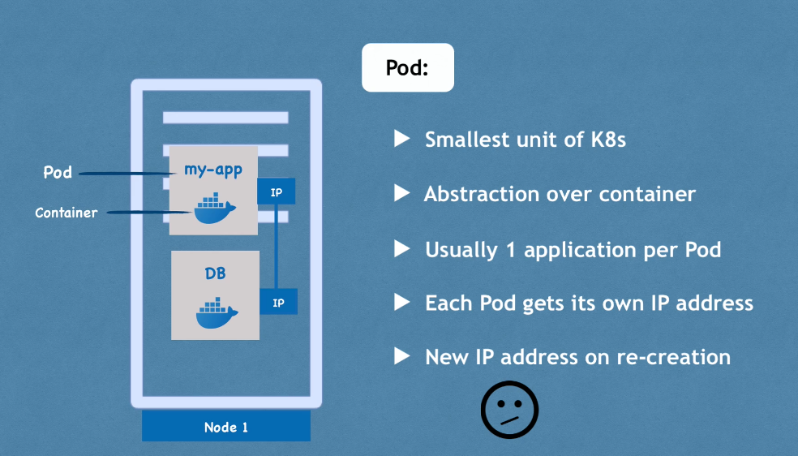
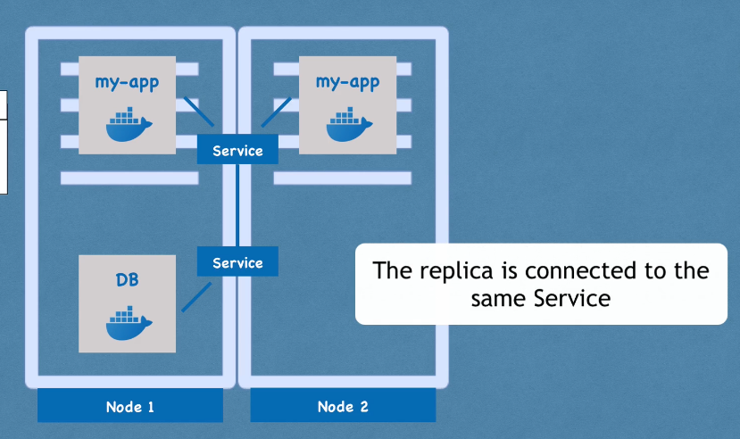

## Kubernetes Introduction

High Availability = It is always accessible by user. An application has no downtime

Scalability = The scalability means that the user has a good response rate from application. It loads fast.

## Kubernetes Components

A pod is the smallest execution unit in Kubernetes. A pod encapsulates one or more applications. Pods are <strong>ephemeral</strong> by nature, if a pod (or the node it executes on) fails, Kubernetes can automatically create a new replica of that pod to continue operations. Pods include one or more containers (such as Docker containers).

If pod dies, the service and its IP address stay. Ther are not connected in terms of lifecycle.

Ingress = Application should be accessible through external sources such as browser. For that, we need external service such as ingress forward request to internal service.

## Volumes Concept

When a POD or Container gets restarted, all data will be persisted.

Replicate everything to improve application availability.

Deployment = It is a blueprint for pods that allows us to specify how many replicas of a Pod you would like to run.

Database cannot be replicated using deploymet component. The reason for that is the database has state which is data. If we replicate Pods of database application, they would share the same storage but we need to have mechanism to identify which one is going to write to database storage and which one is going to read. 

