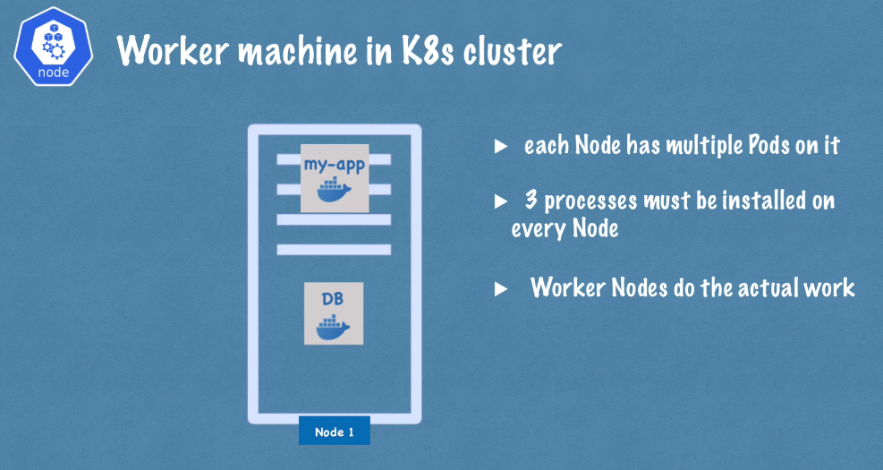
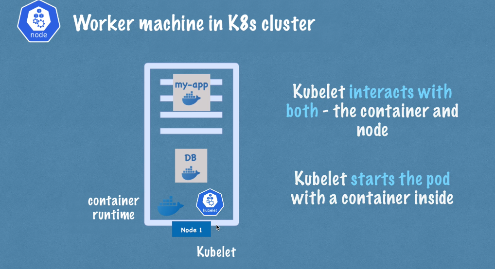
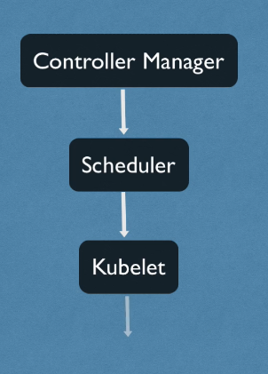

## Kubernetes Architecture

### Node Processes:

Three processes muste be installed on each node that are used to schedule and manage those pods running on the worker node.

1- Container Runtime

2- Kubelet = The kubelet is responsible for starting the pods based on the configuration. It also assign resources (CPU, RAM) from node to pod.

3- Kube Proxy = Responsible for forwarding request from service to correct destinated pods. 

How does kubernetes decide which node should be used to run the new Pod? Which Process handles this work?

Which process monitors those pods if they stop or die?

Which process restart/ re-schedule those pods?

Four processes run on every node that controls the cluster state and worker nodes.

1- API Server = Cluster gateway or it also acts as a gatekeeper for authentication.

2- Schedular = The Schedular takes a request from API server and decides where to schedule that Pod based on the configurations. For examples, how much cpu needs and how much memory needs.

3- Controller Manager = Detects the cluster state changes. When a Pod dies, the controller manager detects that and tries to apply cluster desired state.

 4- etcd

 