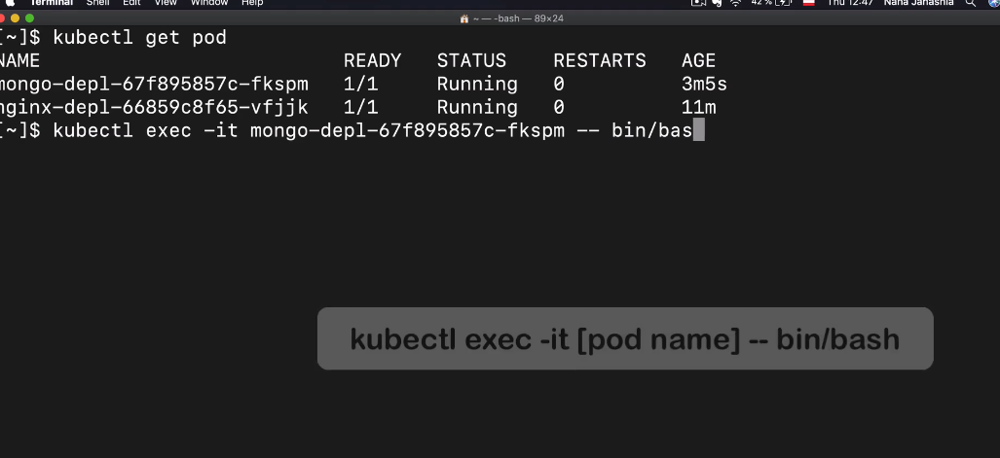

## Kubectl Main CLI Commands

```bash
kubectl get nodes
kubectl get pod
kubectl get services
kubectl get deployment
kubectl get replicaset
```

Replicaset is managing the replicas of a Pod.




```bash
kubectl delete deployment [[deployment_name]] 
```

## Deployment and Service Configuration File Template


Service and Pod Ports


Services endpoints should be matched with the Pods IP addresses.

```bash
kubectl describe service [[service_name]]
kubectl get pod -o wide
```


Get yaml file configuration from running deployment

```bash
kubectl get deployment nginx-deployment -o yaml > nginx-depl-result.yaml
```
## Complete Application Setup With Kubernetes Components


Create a mongo deployment object\

```yaml
apiVersion: apps/v1
kind: Deployment
metadata:
 name: mongo-deployment
spec:
  replicas: 1
  selector:
    matchLabels:
      app: mongo
  template:
    metadata:
      labels:
        app: mongo
    spec:
      containers:
        - name: mongodb
          image: mongo
          ports:
            - containerPort: 27017
          env: 
            - name: MONGO_INITDB_ROOT_USERNAME
              valueFrom:
                secretKeyRef:
                  name: mongodb-secret
                  key: mongo-root-username
            - name: MONGO_INITDB_ROOT_PASSWORD
              valueFrom:
                secretKeyRef:
                  name: mongodb-secret
                  key: mongo-root-password
```

Create Secret for mongodb username and password

```bash
echo -n "ibrar" | base64
echo -n "ibrar123" | base64
```


```yaml
apiVersion: v1
kind: Secret
metadata:
  name: mongodb-secret
type: Opaque
data:
  mongo-root-username: aWJyYXI=
  mongo-root-password: aWJyYXIxMjM=
```
Apply secrete

```bash
kubectl apply -f mongo-secret.yaml
kubectl get secret
```

Apply mongo deployment

```bash
kubectl apply -f mongo-depl.yaml
kubectl get deployment
```

Create service


```yaml
apiVersion: v1
kind: Service
metadata:
  name: "mongodb-service"
spec:
  selector:
    app: mongodb
  ports:
    - protocol: TCP
      port: 27017
      targetPort: 27017
```


```minikube service [[external_service_name]]```