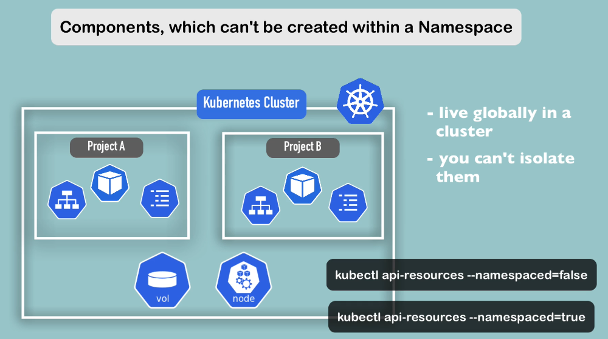

## Kubernetes Namespace

You can organize your resources in a namespace.


4 namesapces by default


kubernetes-dashboard namespace is only available in minikube setup. you don't have it in standard cluster.

1- kube-system namespace is not for our use. Don't create or modify anything in this namepsace. The components that are deployed inside that namespace are system processes such as master processes

2- kube-public namepsace contains publicly accessible data. It has configmap which stores configuration data.

3- kube-node-lease


4- The resources we create are going to be reside in that namespace if we have not created any namespace.

```bash
kubectl create namepsace my-namepsace
```

## Why use namepsaces?

1- Group Resources


 Don't put everyhting inside the one namepsace such as default.

 

 2- Resolved conflicts between teams

 
 

 3- Resource Sharing between environments

 

 3- Resource Sharing: Blue/Green Deployments


4- Access and Resource Limits

Imagine a scanerio where we have two teams working on a same cluster, each one of them has their own namespace. You can give the teams access to only thier namepsace. In that way, The teams cannot interfer with other team namespace.


you can define resource quota at the namespace level.

## Characteristics of the namespaces

1- You can't access most resources from another Namepsace.

You cannot use configmap in project b namepspace.


Instead, you can define new configmap in project b that also reference database service.


The same characteristic applies to Secret component.




--------------------------------------------


----------------------------------------------

If you don't want to specify -n flag in your kubectl command to get or create components inside the specific namespace, you can change the active namespace using kubens

