## Linux File System

#### home/ dir
Each user will have its own space in home directory except for root user
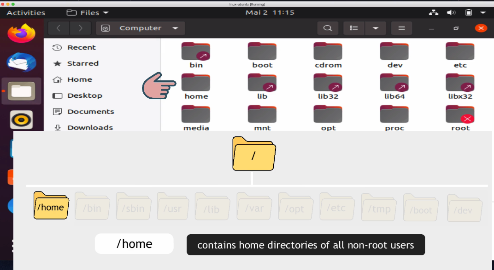

#### /root dir
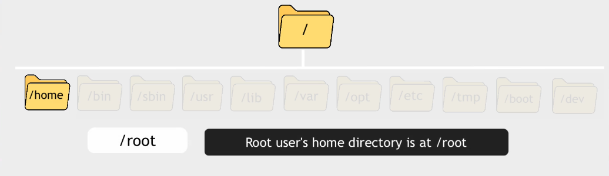

#### /bin dir
Bin directory conatins the most basic commands you have avaiable on your OS.
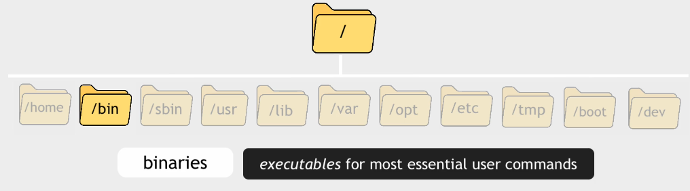

#### /sbin dir
Sbin contains system commands for which you would need to have root privileges to execute them.
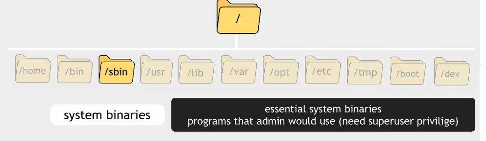

#### /lib dir
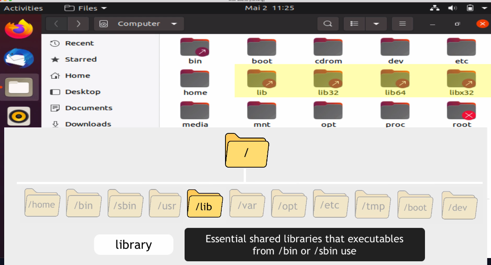

#### /usr/local
Third party applications like docker, java
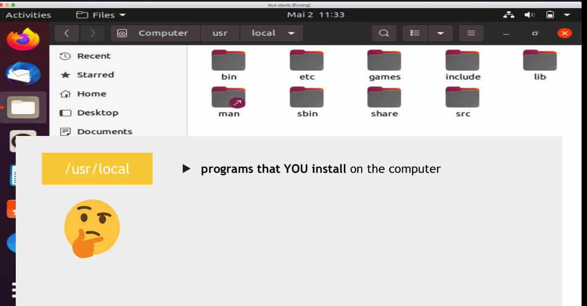
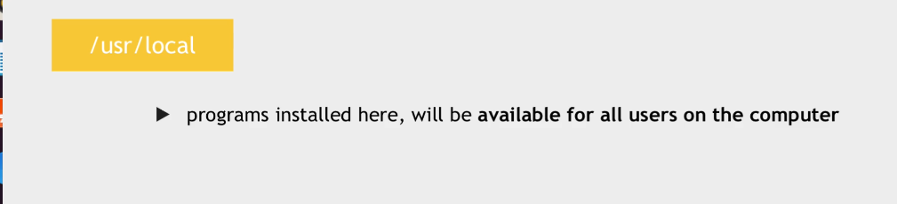

#### /opt dir
Whatever you install here, will be system-wide and avaiable for all users similar to /usr/local
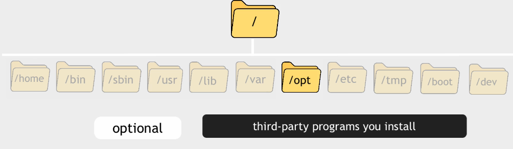

#### different between /usr/local and /opt
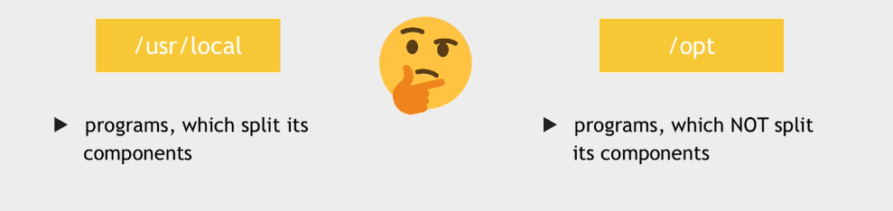

#### /boot
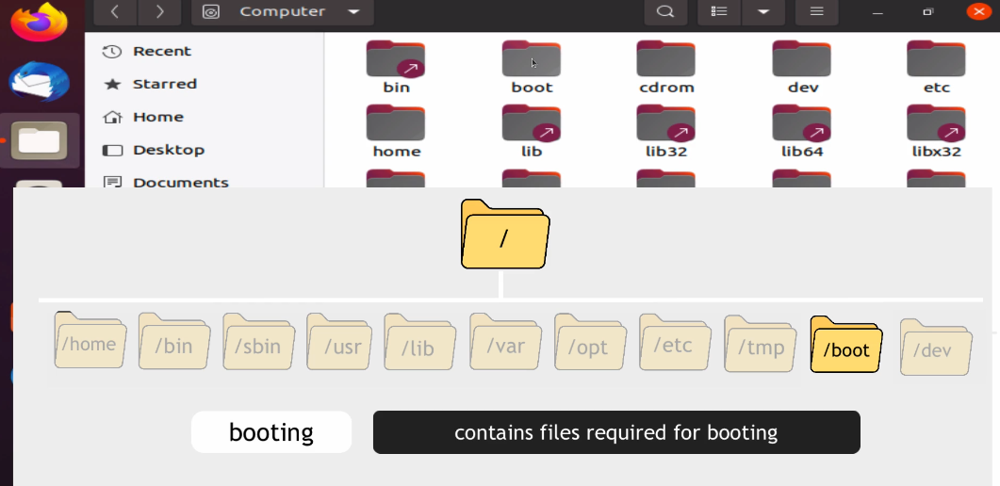

#### /etc
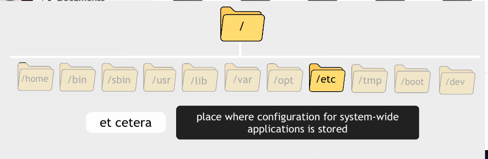

#### /dev
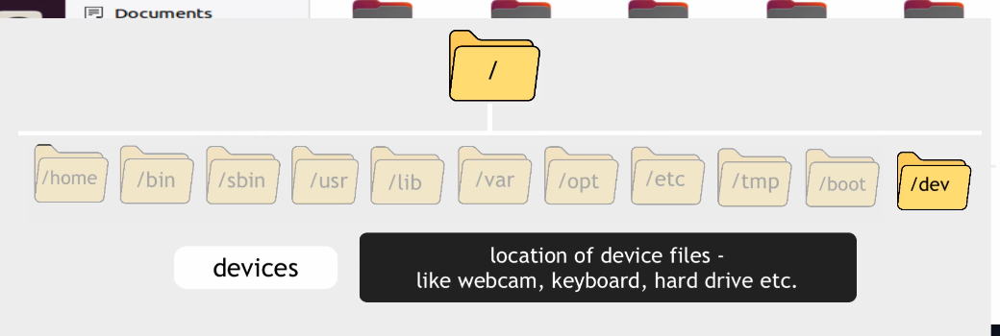
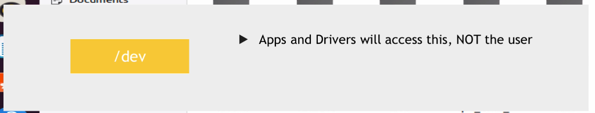

#### /var
When computer starts, it actually logs some data. These logs are actually stored in the folder /var/log
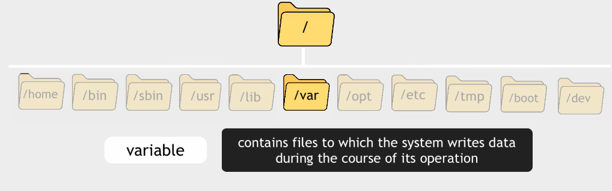
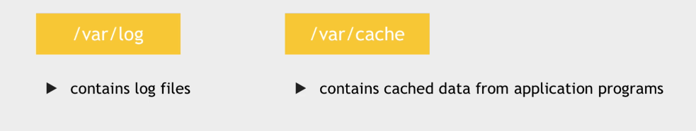

#### /tmp
temporary files and folders

#### /media
External medias such as External hard drives, usb and cd. These medias will be mounted into this folder automatically.
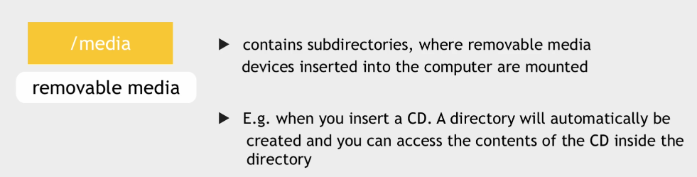

#### /mnt
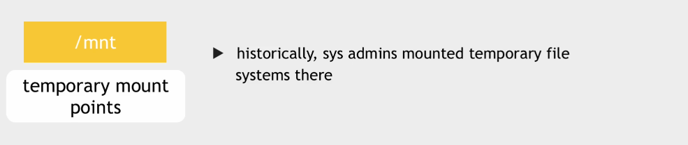