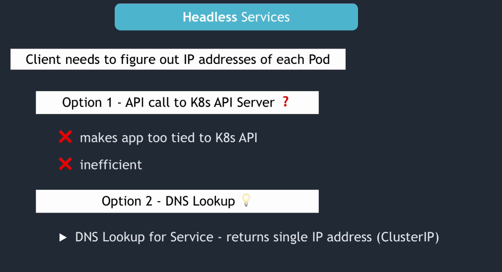
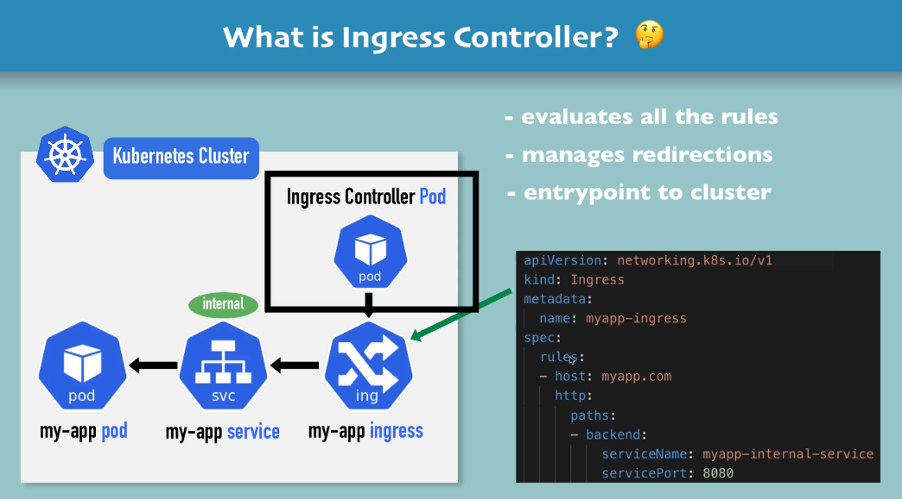

## Kubernetes Services

### 1- Cluster IP Service

Note that when you create a service, kubernetes creates an endpoint object that has a same name as service and kubernetes keep track of which pods are members of the service.

### Multi-Port Services

When you have multiple ports defined in a service, you have to name those ports.

### 2- Headless Service

NodePort Service:

LoadBalancer Service:

When you create a Load balancer Service, NodePort and ClusterIP services automatically created by kubernetes. NodePort Port is only accessible via Cloud Provider Load balancer.

--------------------------------------------------

## Ingress

## Some Use-cases for Ingress

