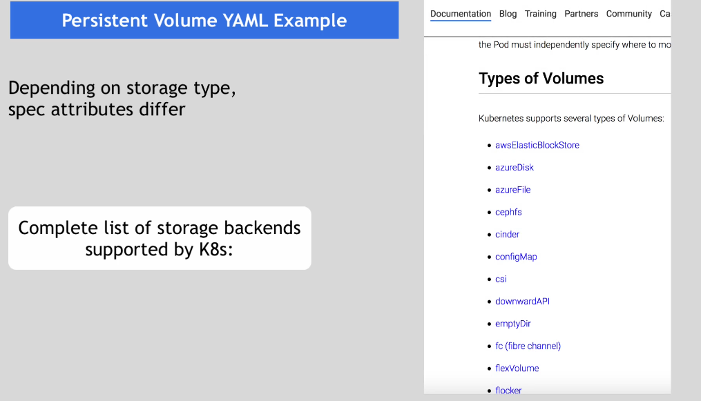
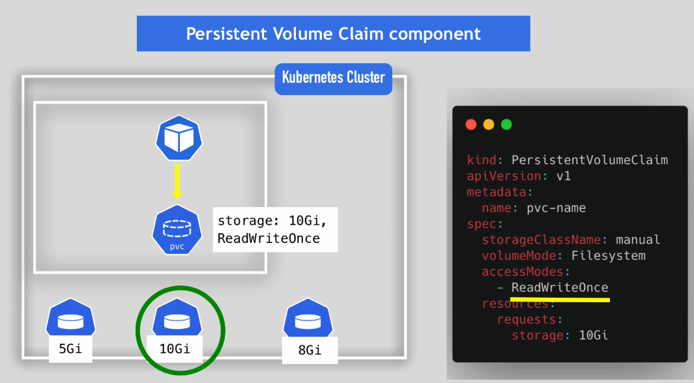
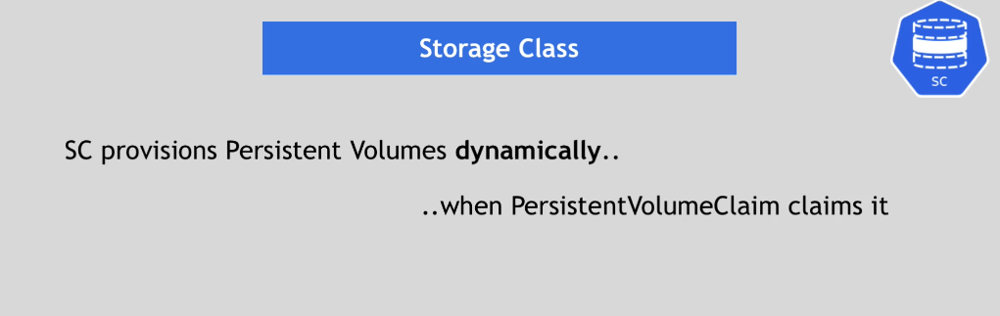

## Kubernetes Volumes

## Storage Requirements

1- Storage doesn't depend on the Pod lifecycle. If the MySQL gets restarted, the storage component must be available and have all the data.

2- We don't know where the pod is going to be scheduled. Basically, We don't know on which Node the pod will be scheduled. Storage must be available on all nodes.

3- The Storage needs to survive even if the cluster crashed as a whole.

## Persistent Volume

## Local vs Remote  Storage

### Persistent Volume should be there in cluster before

### Kubernetes Roles

Based on the storage requirements from developers team of what type of storage they need, K8s admin will provision that storage backend by using PV component.

### PVC

### Levels of Volumes Abstraction

### Note that Claim must be in the same namespace as Pod using that claim

### Different Volume types in POD

### Storage Class

