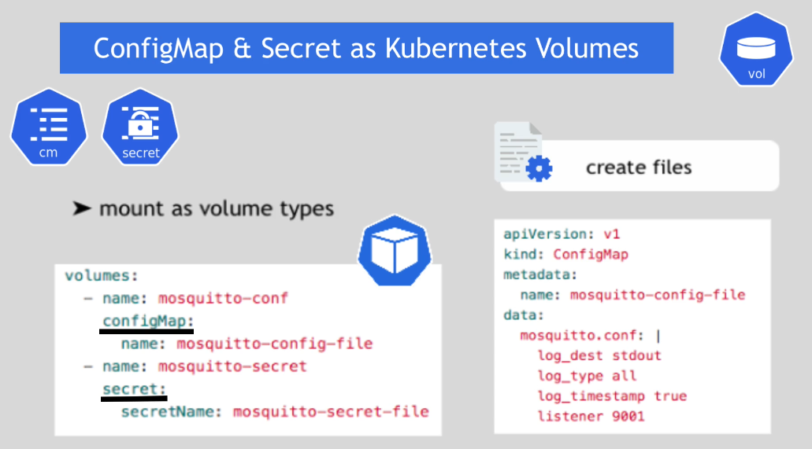
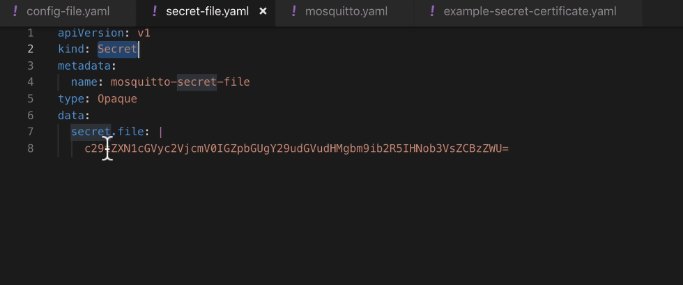

## Configmap and Secret as Kubernetes Volumes

## ConfigMap and Secret use-cases

1- With these components, you can create individual key value pairs such as username and password.

2- But, By using these components, you can also create files that will be mounted into Pod and then mounted into the container. Some Application needs configuration files on start.

## Examples

## StatefulSet

What is stateful Application?

Any Application that stores data to keep track of its state. In other words, the stateful application tracks state by saving information in some storage.

Pod identity

only one pod will be master pod responsible for writing into the database and other pods are reader.

Each Pods has its own physical storage. They don't use the same physical storage.

In addition to Pod identity, Each pod has it DNS endpoint from a service.

## 2 Charactertics (Fixed Pod name and Fixed DNS Endpoint) 

