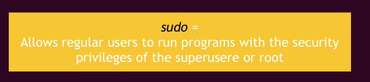

## Basic Commands

### Directory Operations
1- pwd = show current working directory
2- ls = list folders and files
3- cd = Change directory (cd [[dir_name]])
4- mkdir = make directory (mkdir [[dir_name]])

### File Operations
1- touch = create a new file (touch main.py)
2- rm = remove file (rm main.py)
3- rm -r [[dirname]] = delete non empty directory and all the files within it
4- rm -d [[dirname]] = delete empty directory
4- rmdir [[dirname]] = delete empty directory

Absolute path = Move to any location by providing full path

### More file and directory Operations
1- mv [[filename]] [[new_filename]] = Rename the file/folder to a new file/folder
2- cp -r [[dirname]] [[new_dirname]] = copy directory to a new directory
2- cp -r [[filename]] [[new_filename]] = copy file to a new file
3- ls -R Documents = list files and folders recursively without navigating to each folder

history = Gives a list of all past commands typed in the current terminal session
history 20 = show last twenty commands

ctrl + shift + v = Paste copied text into terminal

cat [[filename]] = Display the file content

uname -a = Show system and kernal

lscpu = list cpu information
lsmem = list memory information

su - admin = Switch or logged in with different user