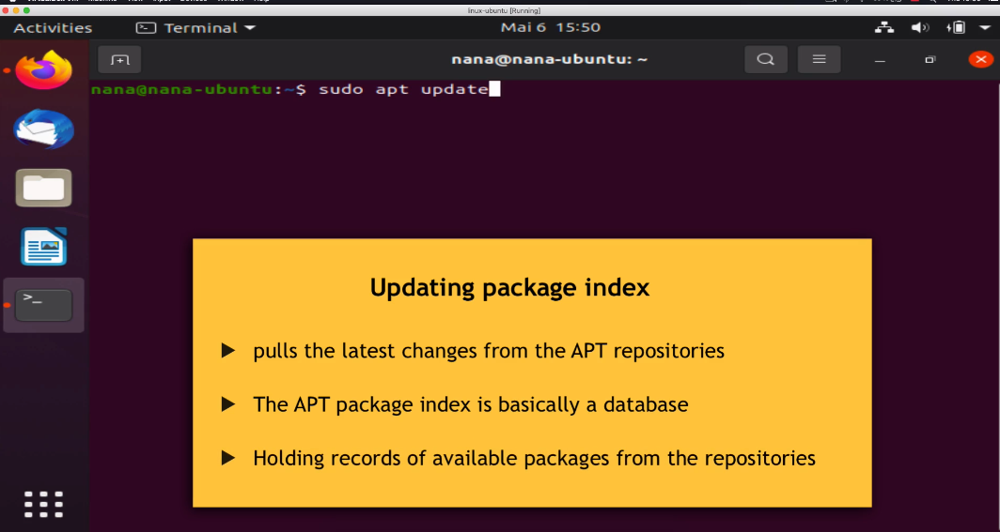

## Package Manager

### What is Software Package?

Installing software on linux is more complicated because the files are going to spread across different folders.

That's where we need a package manager to install software on linux

apt search [[package_name]] = search package
apt remove [[package_name]] = Remove package

shift + ctrl + c = copy
shift + ctrl + v = paste

#### APT vs APT-GET

### Where these packages come from? Where these programs are stored?
Linux uses Repositories. A Repository is a location where all thousands of programs are stored

### Update Package Index

### Add Respostory

### PPA

