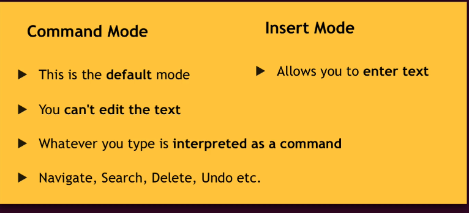
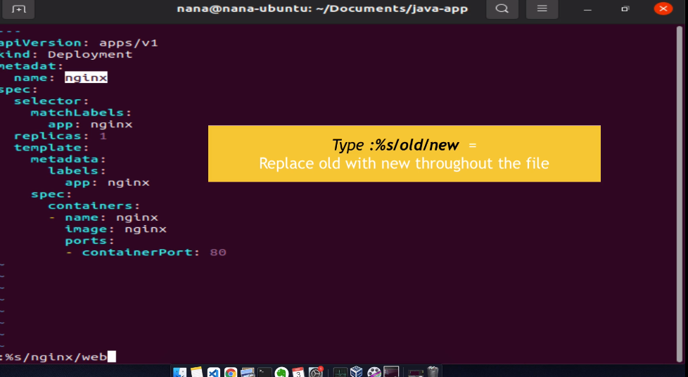

## Working with VIM Editor

Press i key = Switch to insert mode

Pres esc key = Switch to command mode

Type :wq = write the file to disk and quit vim

Type :q! = Quite vim without saving the changes

Type dd = Delete the entire line

Type d10 = Delete next 10 line

Type u = Undo 

Type A = Jump to end of line and Switch to insert mode

Type 0 = Jump to start of line

Type $ = Jump to end of line without Switching to insert mode

Type 12G = Go the line 12

Type /pattern = Search pattern in file and Type n = Jump to next match and Type N = Search in Opposite direction

