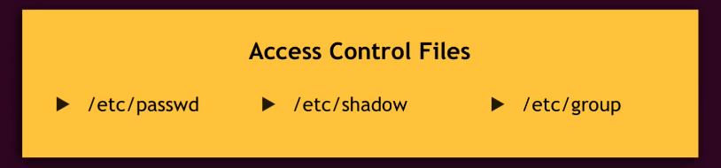
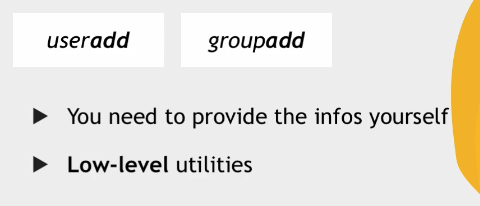
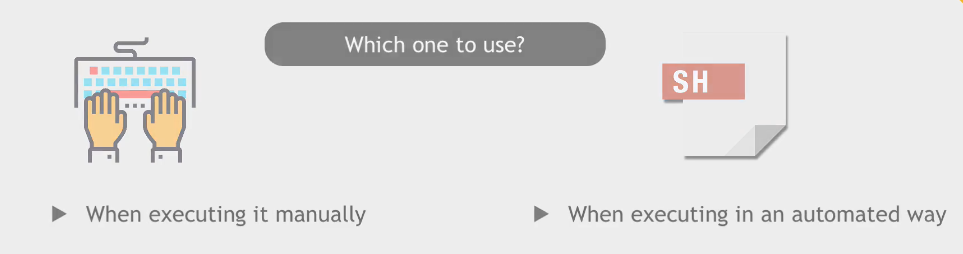

## Linux User and Permissions Part 1

### User Accounts

### 1- Superuser Account
Whenever you need to perform administrative tasks or access restricted files on system, you need to login as root user.


### 2- User Account


### 3- Service Account
No service (Apache, Mysql) should be run as a root user because it will get root user privileges. It may disrupt the whole system


### Permissions Level





#### Create User


#### Change Password


#### Switch User


#### Create Group


#### Commands difference




#### Change User Primary Group


delgroup = delete the group


#### Add Secondary Group


#### Adduser command


#### Remove user from group

```sudo gpasswd -d tom devops```