## Deploy Java React project on AWS EC2

In this project, we will learn the process of deploying simple Java application on the AWS EC2 and accessing it through browser. The project has used Gradle as a build tool. All we need to do is that first we need to build the project locally and copy the jar file to AWS EC2 to run application there.

## Tools & Technologies:
1- IDE (IntelliJ)
2- Use OpenJDK 1.8.0

## Steps:
1- Clone the project by using the given link

```https://github.com/ibrarmunircoder/java-react-example.git```

2- Use IntelliJ to clone the project

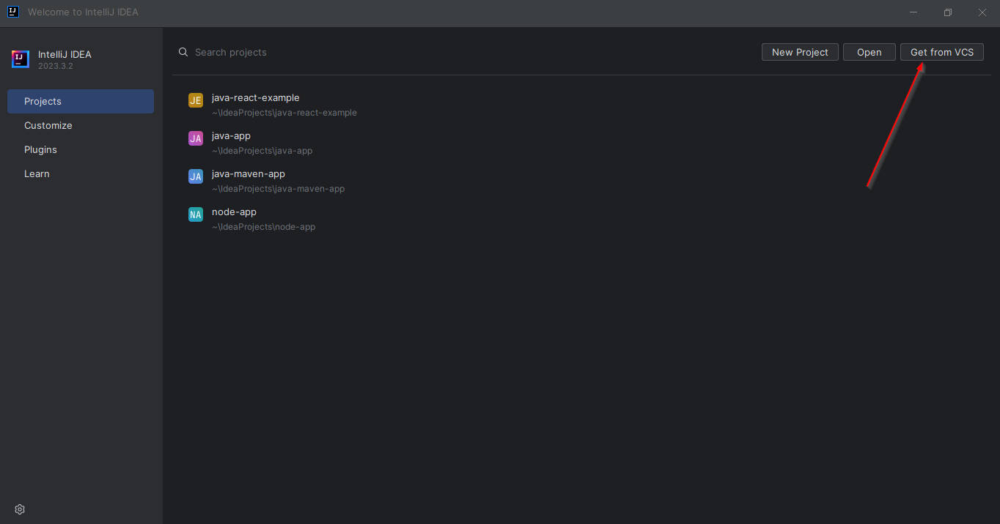

3- Run the gradle build command

```./gradlew build```


4- After build command is successfully completed, you will see the build folder and specifically jar file which we are going to ship to AWS EC2 using Linux SCP command.

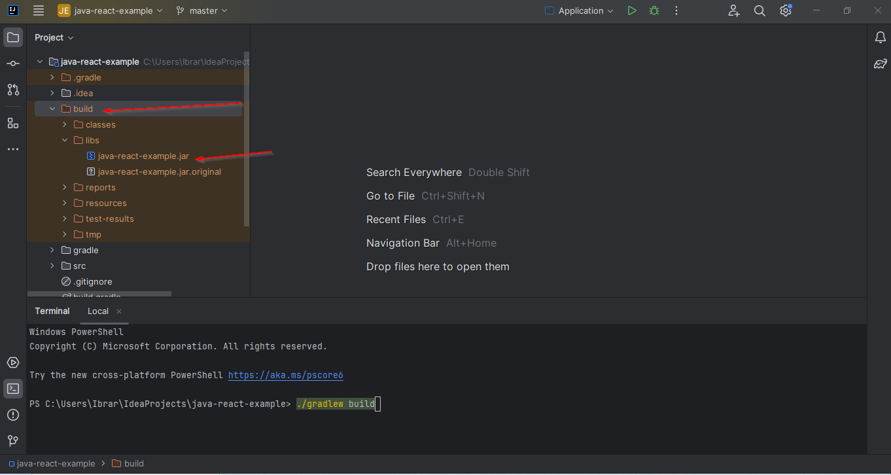

5- Go to the AWS Management Console and open the EC2 dashboard and Lunch a new instance

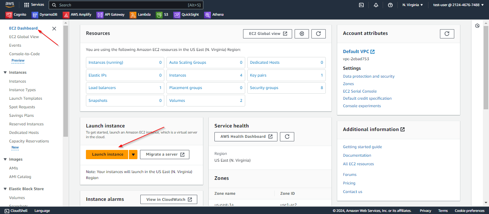

6- Add name for instance and select ubuntu image 

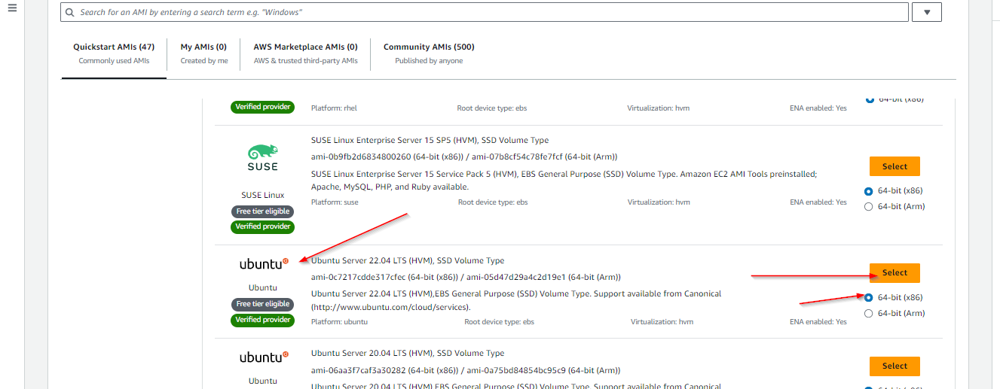

7- Create Key pair to connect to server from local computer and configure ther server as needed.

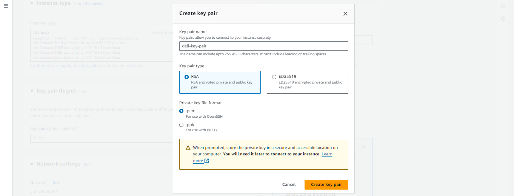

8- Under networking setting pane, click on edit button. Don't change the VPC and subnet inputs, we will use default VPC. Add a new Security Group with some rules.

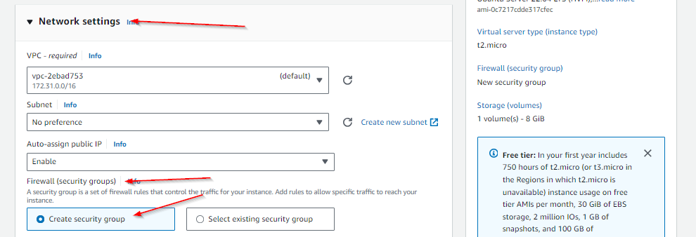
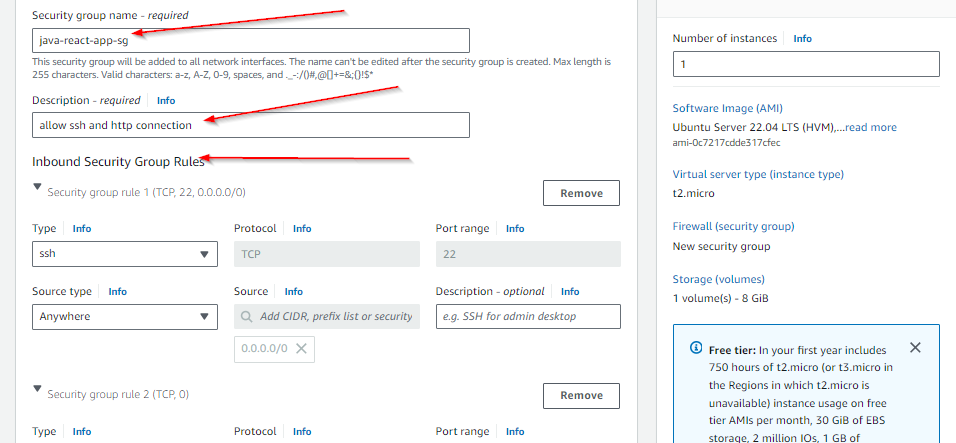
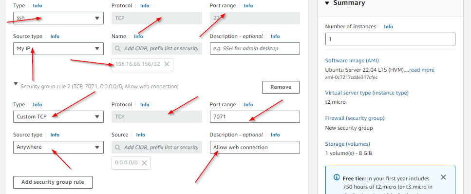

9- Click on launch to create a new instance.

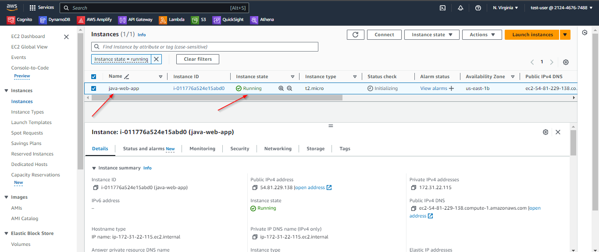

10- As a security best practice, we should create a separate linux user to run application. 

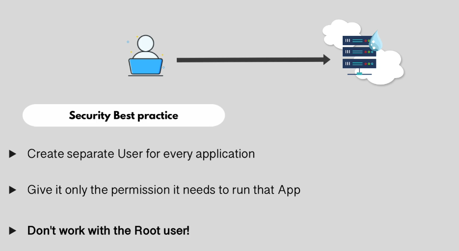

11- Use the following command to ssh into the remote server. Make sure you use your Public ip in the command

```ssh -i dell-key-pair.pem -p 22 ubuntu@54.81.229.138```

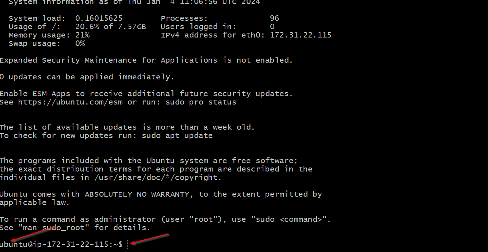

12- Add a new linux user with adduser command

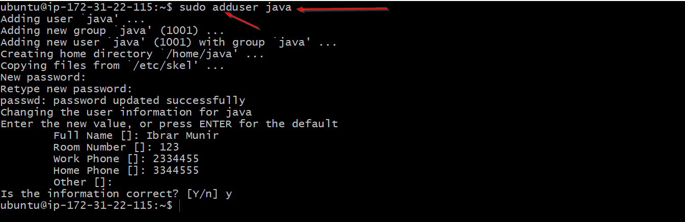

13- Next, i want to allow this user to execute some of the commands that ubuntu user can execute. For that, i need to add this user to sudo group

```sudo usermod -aG sudo java```

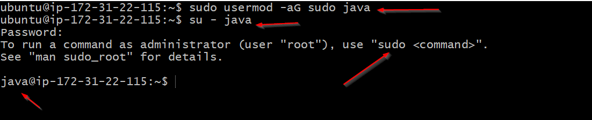

14- Let's see Can i use this user to access remote server using ssh command? Actually, we cannot as we have defined public key for this user.

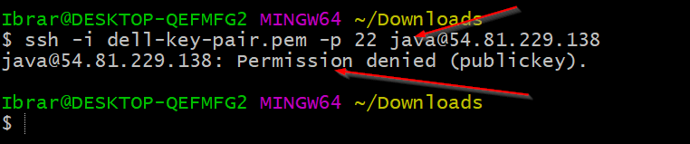

15- Reconnect with ubuntu user. Go to the .ssh folder created inside the user home (~) directory. And Print the content authorized keys file.

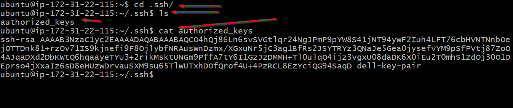

16- Copy the Public key and switch to java user. Create a ssh folder under java user home directory along with authorized keys file. Then paste public key inside that file

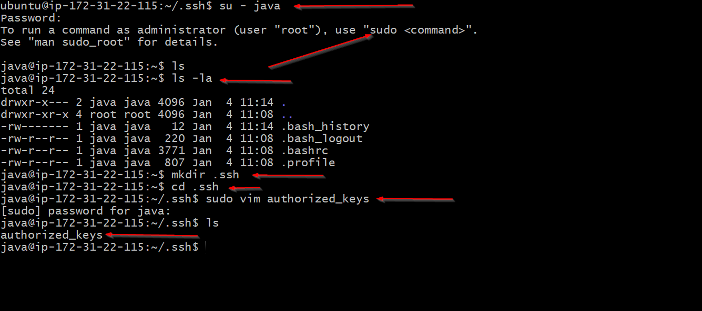
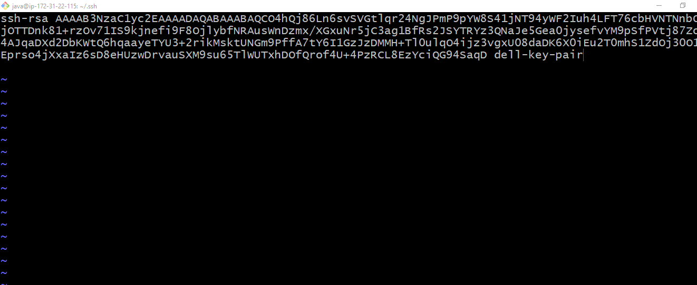

17- Now, you can see that i am successfully connected with the remote server as a java user.

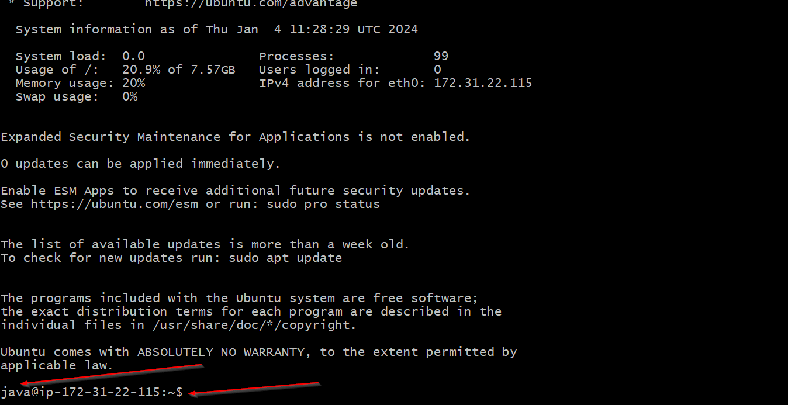


18- Run the following command to copy jar file from local to remote server under java home directory

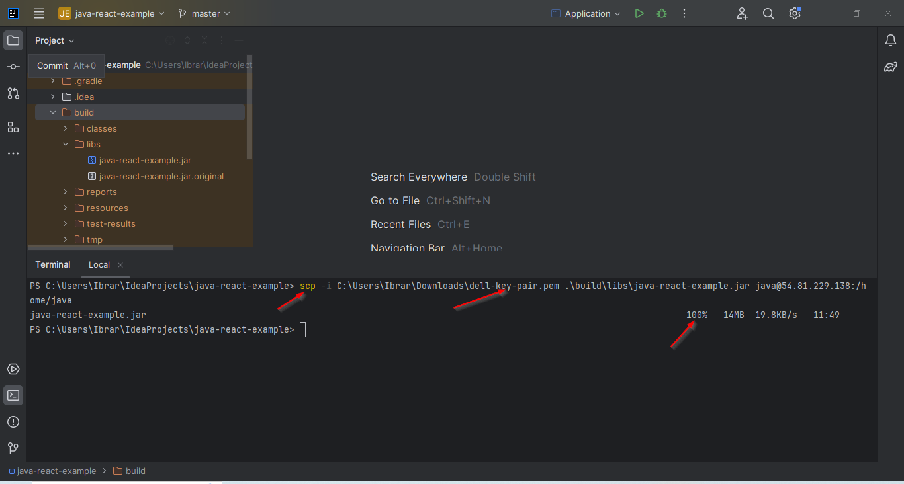
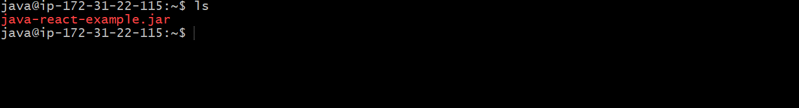

19- Run the following command to download java on the server

```sudo apt update```
```sudo apt install openjdk-8-jre-headless ```

20- Run the jar file with this command

```java -jar java-react-example.jar &```

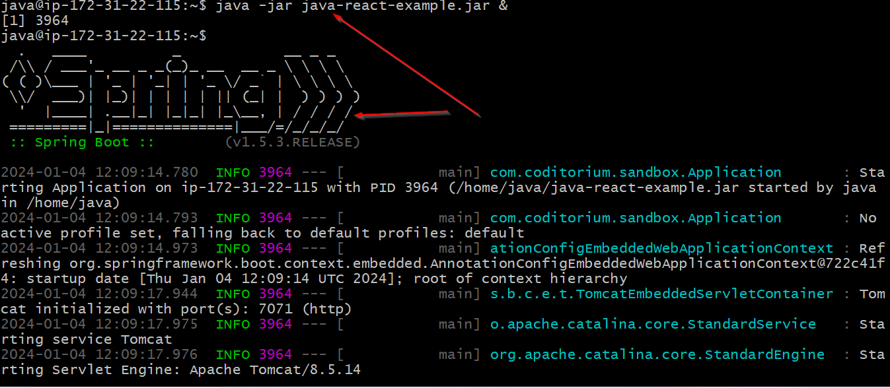

Congratulations, you have successfully deployed java application on a real world server. Nice job!

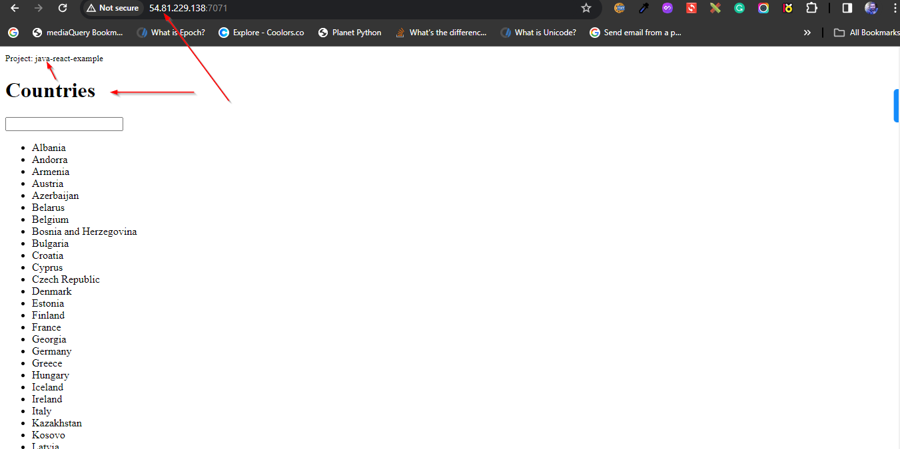
