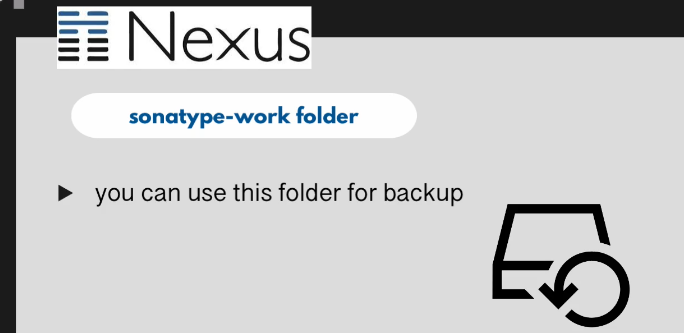
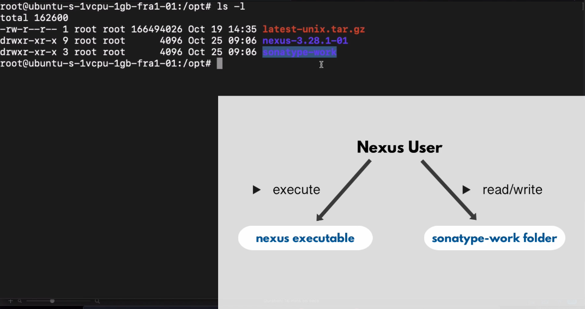
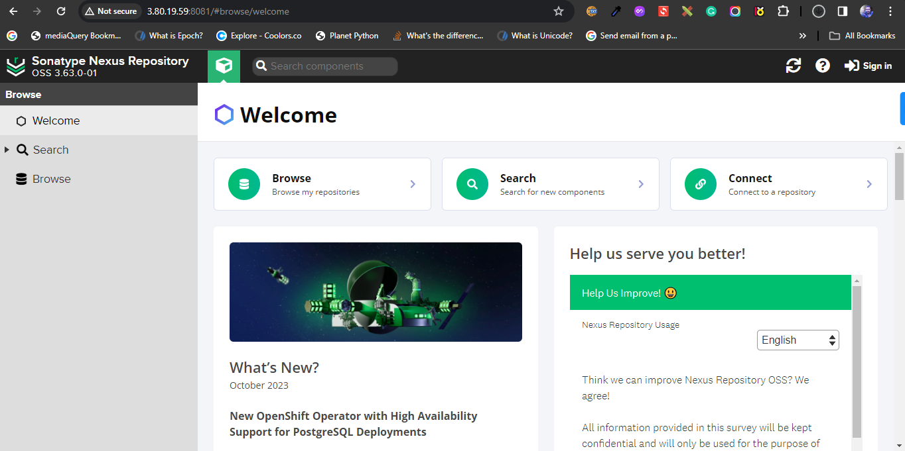
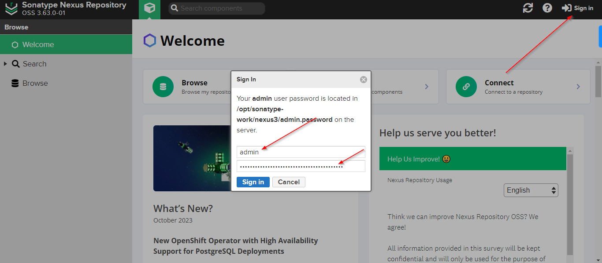

## Install and Configure Nexus Server

In the project, we are going to setup nexus on the AWS EC2. To follow along, you should create EC2 instance of type t2 medium size.

I have already deployed and connected to ec2 instance to be able to setup nexus.


## Steps:

1- Run the following command to download java 8
```sudo apt update -y```
```sudo apt install openjdk-8-jre-headless```
```java -version```

2- Change into /opt directory and download nexus package

```cd /opt```
```sudo wget https://download.sonatype.com/nexus/3/nexus-3.63.0-01-unix.tar.gz```


3- Untar the file

```sudo tar -zxvf nexus-3.63.0-01-unix.tar.gz```

you will see two folders created inside /opt folder. One is for nexus used to store applications binaries and second is for nexus configuration and data that you uploaded as an artifact.


if you nexus server has some issues, you can recover you nexus confiugrations, plugins and data if you have backup of sonatype-work folder backup.



4- Create a nexus user

```sudo adduser nexus```


5- If you want to allow nexus user to execute nexus application, we need to change ownerships of nexus folder and sonatype-work folder from root user to nexus user.



```sudo chown -R nexus:nexus nexus-3.63.0-01```
```sudo chown -R nexus:nexus sonatype-work```

6- Change nexus configuration to run nexus as a nexus user

```sudo vim nexus-3.63.0-01/bin/nexus.rc```


7- Switch to nexus user

```su - nexus```

8- Start the nexus app

```/opt/nexus-3.63.0-01/bin/nexus start```


9- Open port 8081 on the firewall




10- Login with admin user. you can find the admin password with followin command

```cat /opt/sonatype-work/nexus3/admin.password```

