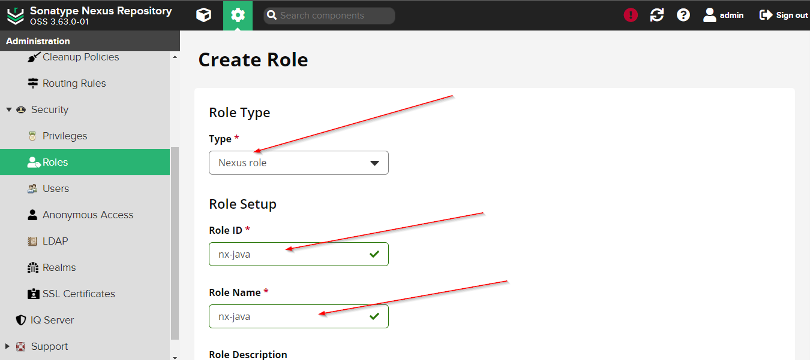

## Publish Java and Gradle Artifacts to Nexus hosted Repository

In this practical demo, we are going to learn how to publish artifacts to nexus hosted repository. As you know, Artifacts need to be stored somewhere safe, so, it can be used for other environments (dev, prod, etc) later.


## Pre-Requisites
1- Make sure you have nexus application installed on AWS EC2. You can see my project 2 to setup nexus application.

## Steps:

1- Create a nexus user. click on the gear icon (Settings) and from left sidebar, click on the users tab.


2- Once you have users screen opened, click on the create local user button.


3- Fills the user form and give it anonymous role


4- The user has been created successfully. From sidebar, click on the roles tab.


5- In the Roles screen, we will see a create role button, click on button.


6- Fills the form and give it maven snapshot view all pivileges




7- Click save to create a role.

8- Assign that role to the user created before.


9- Use the following Gradle project as an example

```https://gitlab.com/ibrarmunir/java-app```

10- Add a plugin for publishing jar to maven formatted repository 


11- Add the publishing block in build gradle file

```publishing {
    publications {
        maven(MavenPublication) {
            artifact("build/libs/my-app-$version"+".jar") {
                extension 'jar'
            }
        }
    }

    repositories {
        maven {
            name 'nexus'
            url 'http://54.210.82.35:8081/repository/maven-snapshots/'
             allowInsecureProtocol = true
            credentials {
                username
                password 
            }
        }
    }
}
```


12- Create a gradle properties file where we will define nexus username and password since these are sensitive information.


13- Build the project

```./gradlew build```

14- Publush the artifact

```./gradlew publish```


### Publish Maven project to Nexus

1- Use the following project as an example

```https://gitlab.com/ibrarmunir/java-maven-app```

2- Open the pom.xml file and define the puglin just like gradle that enables maven to publish artifact to nexus

```
<build>
        <pluginManagement>
            <plugins>
                <plugin>
                    <groupId>org.apache.maven.plugins</groupId>
                    <artifactId>maven-deploy-plugin</artifactId>
                    <version>2.8.2</version>
                </plugin>
            </plugins>
        </pluginManagement>

        <plugins>
            <plugin>
                <groupId>org.apache.maven.plugins</groupId>
                <artifactId>maven-deploy-plugin</artifactId>
            </plugin>
        </plugins>
    </build>
```


3- Next step, define nexus repository configuration in pom.xml

```  <distributionManagement>
        <snapshotRepository>
            <id>nexus-snapshots</id>
            <url>http://54.210.82.35:8081/repository/maven-snapshots/</url>
        </snapshotRepository>
    </distributionManagement>
```

4- The way we configure nexus user credentials for repository in maven is in the .m2 folder in the user home directory. Create settings.xml file inside the .m2 folder inside the home directory.


5- Build the project using mvn package

```mvn package```

6- Deploy artifact

```mvn deploy```

