## Demo: Docker in Software Development

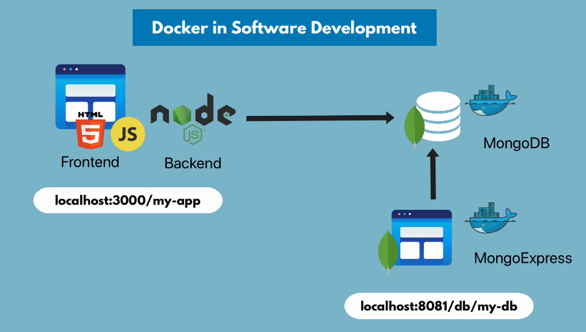

1- Let's pull mongo and mongo-express images

```docker pull mongo```
```docker pull mongo-express```
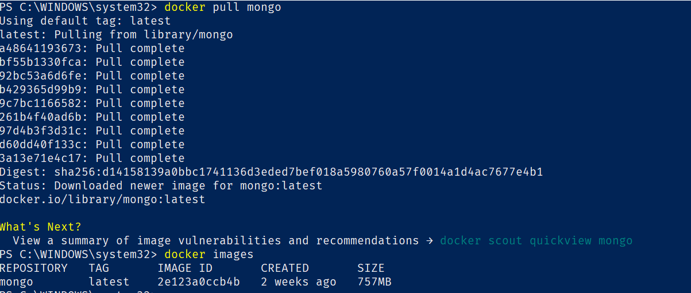
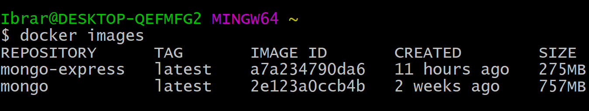

## Docker Network

Docker containers run inside docker network. They can talk to each using just the container name without localhost, port becuase they are in the same network.

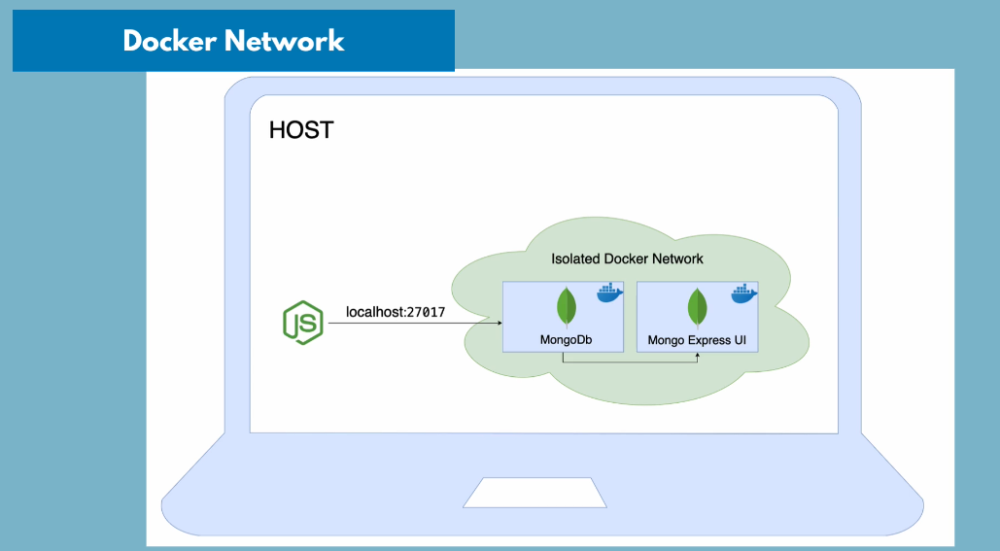
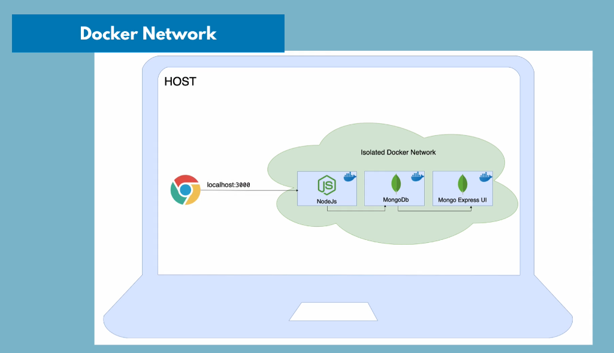

Docker by default provides some network.

```docker network ls```

Create a new network 

```docker network create mongo-network```

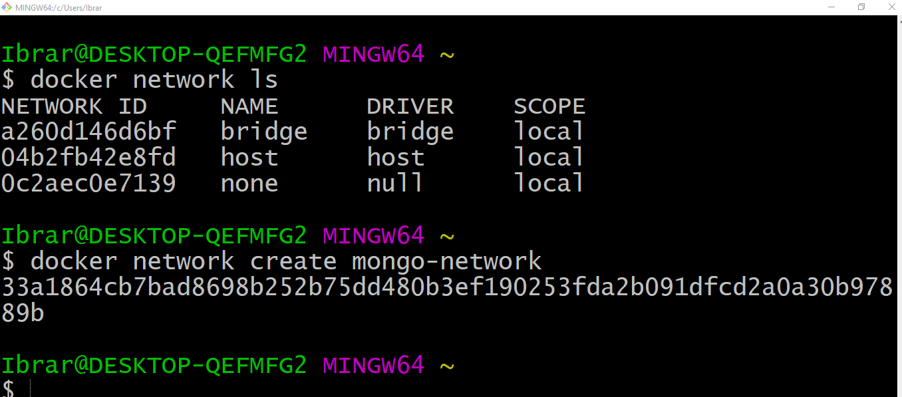

Start the mongo container inside the new network 

```docker run -p 27017:27017 -d -e MONGO_INITDB_ROOT_USERNAME=admin -e MONGO_INITDB_ROOT_PASSWORD=admin123 --name mongodb --net mongo-network mongo```

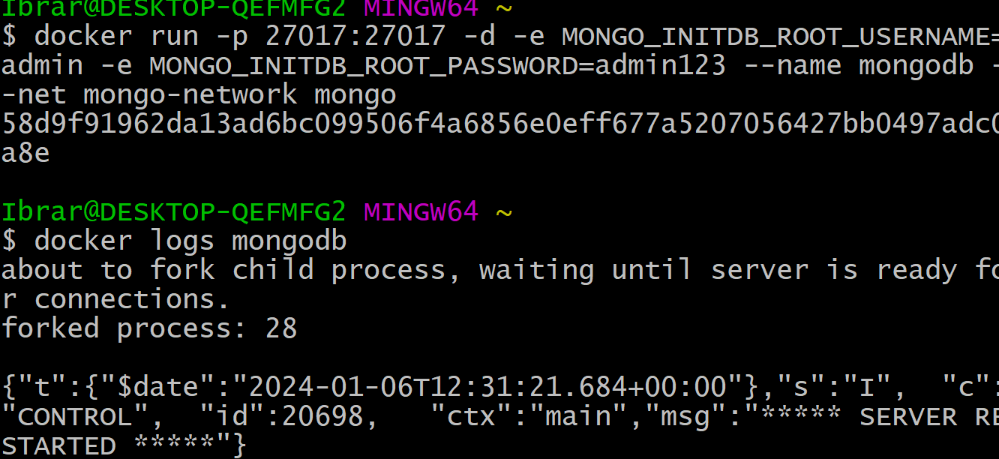

Start the mongo express container inside the new network 

```docker run -d -p 8081:8081 -e ME_CONFIG_MONGODB_ADMINUSERNAME=admin -e ME_CONFIG_MONGODB_ADMINPASSWORD=admin123 -e ME_CONFIG_MONGODB_SERVER=mongodb --net mongo-network --name mongo-express mongo-express```

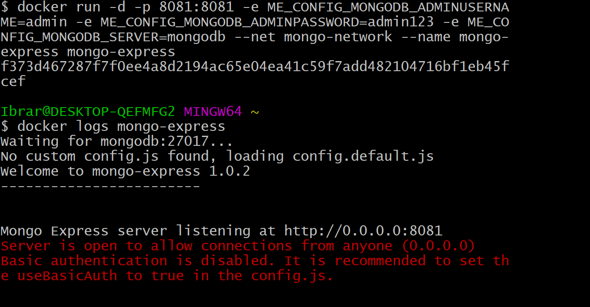

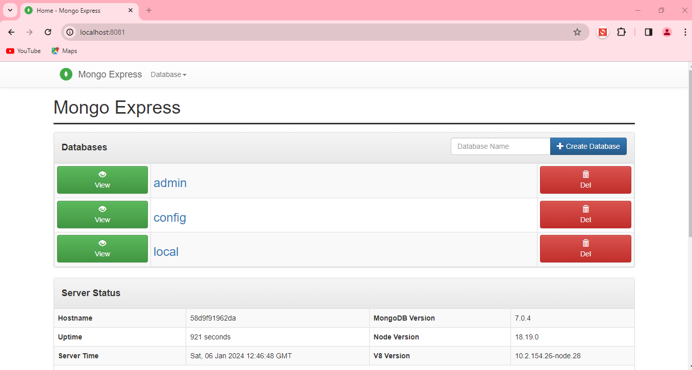

Now, Let's connect Nodejs backend with mongodb database. Clone the nodejs backend application by using the following link.

```https://gitlab.com/ibrarmunir/developing-with-docker.git```

Run the npm install command to download dependencies.

```npm i```

After you have cloned the nodejs backend application, open the server js file and update the mongo local url with the correct credentials and database name.

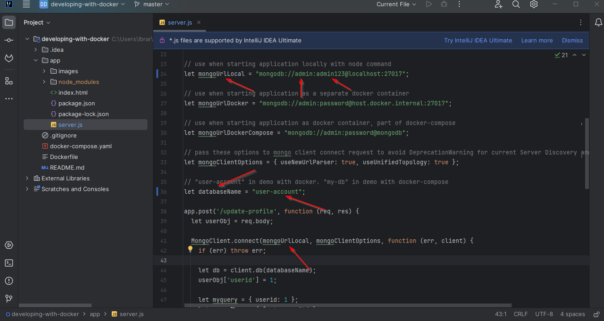

Run the Nodejs application with:
```npm run start```

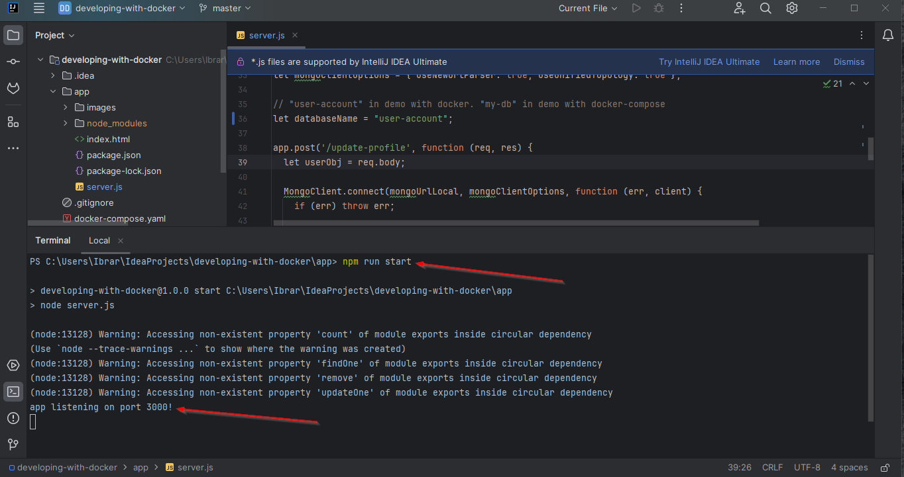

Open the browser and visit the localhost on port 3000 to load web app. Update the profile info and see if you see document in the mongodb collection.

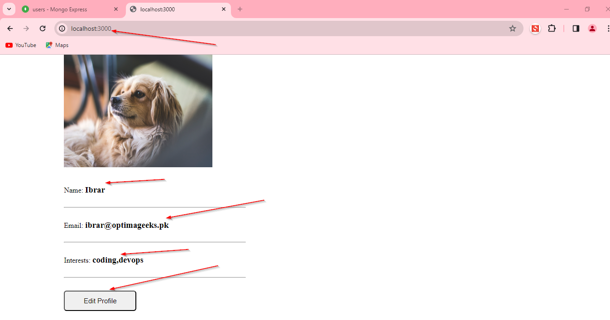
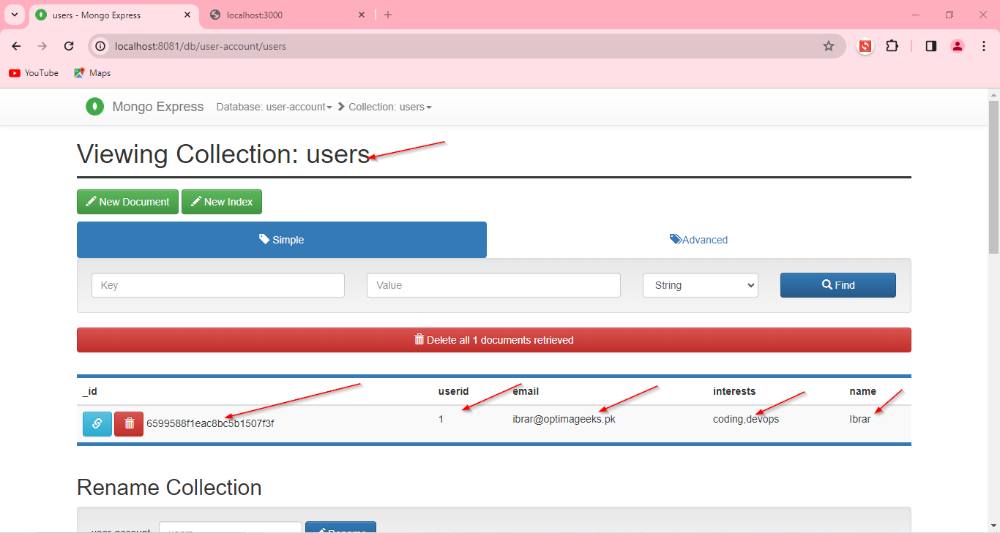

Congratulations. You have completed the demo project. This is how local development looks like with docker.