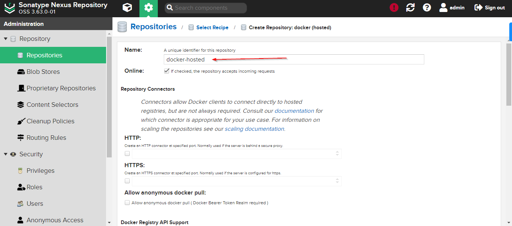

## Project: Push Docker Image to Nexus Repository

## Overview:

In the dynamic landscape of modern software development, containerization has emerged as a pivotal technology, providing a standardized and efficient way to package, distribute, and deploy applications. Docker, a leading containerization platform, has revolutionized the way we build and ship software by encapsulating applications and their dependencies into portable containers.

To facilitate the management and distribution of Docker images, repositories play a crucial role. Nexus, a powerful repository manager, extends its capabilities to support Docker images, offering a centralized hub for storing, versioning, and sharing container artifacts. This blog will guide you through the process of pushing Docker images to Nexus, unlocking the benefits of centralized image management and enhancing the reliability of your software delivery pipeline.

## Pre-Requisites

1- Nexus Application running on a server
2- Docker image of your application


I have deployed nexus application on the AWS EC2.


## Steps:

1- Let's start the nexus application on the aws ec2. In order to start the application, you need to connect to the remote server and runs the command there.

```/opt/nexus-3.63.0-01/bin/nexus start```


2- Create the nexus docker hosted repository on the nexus. Click on create repository button.


3- Select the docker hosted repository option from list.


4- Fill the create repository form. You need to add name and selecte default blob store.




5- Now, we need to create a role that has access to docker hosted repository. Select the Roles tab from sidebar and on the roles screen, you need to click on create role button.


6- Fill the form.


7- Assign a role to an existing user.


8- Update docker hosted repository to enable HTTP option along with specific port to allow docker login command to work properly.


A new port is opened on nexus server.


9- Next step would be that we need to activate docker bearer token which is going to be used to authenticate against the docker hosted repository on the nexus.


10- As you know, My Nexus application is running on HTTP. We need to tell docker client that please allows the insecure registeries. The easiest way to do that on the windows is by using the docker desktop. Go to settings and select Docker Engine tab from sidebar and change the configuration.


```json
{
 "builder": {
  "gc": {
   "defaultKeepStorage": "20GB",
   "enabled": true
  }
 },
 "experimental": false,
  "insecure_registries": ["35.153.192.170:8083"]
}
```

11- Docker login

```docker logn 35.153.192.170:8083```


12- Docker Build. Build your docker image that you want to push.

```docker build -t my-app:1.0 .```


13- Re-tag the image with repository url

``` docker tag my-app:1.0 35.153.192.170:8083/my-app:1.0```

14- Docker push

```docker push 35.153.192.170:8083/my-app:1.0```


