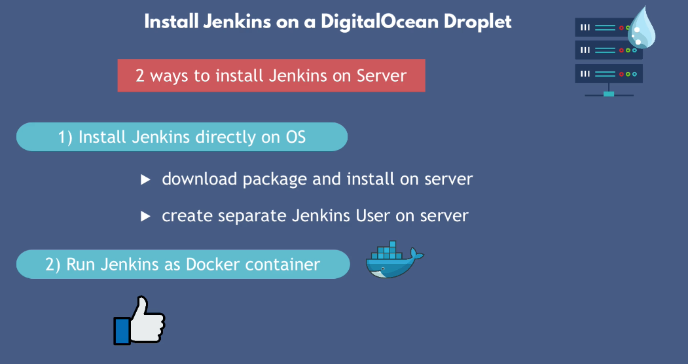
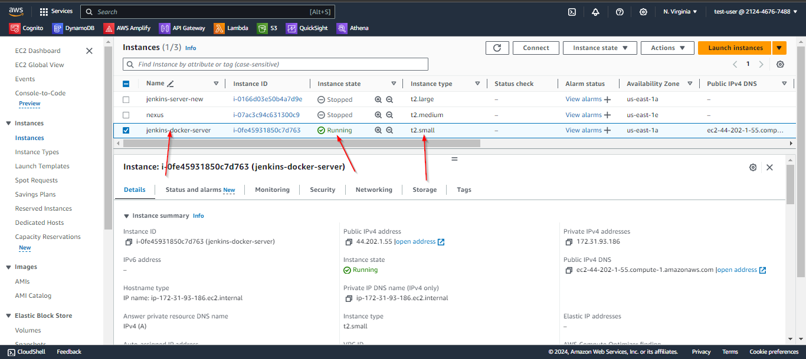
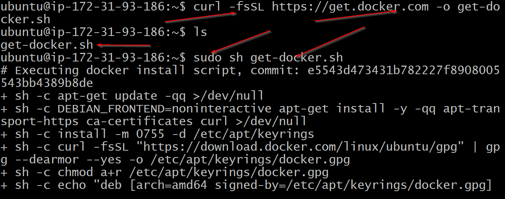
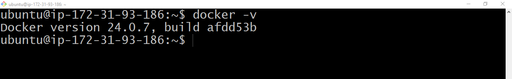
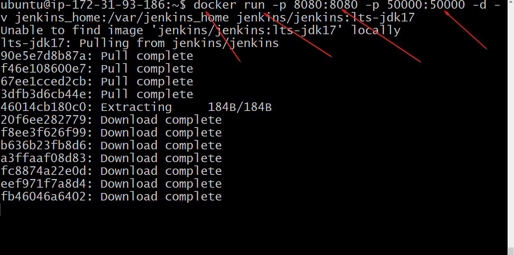
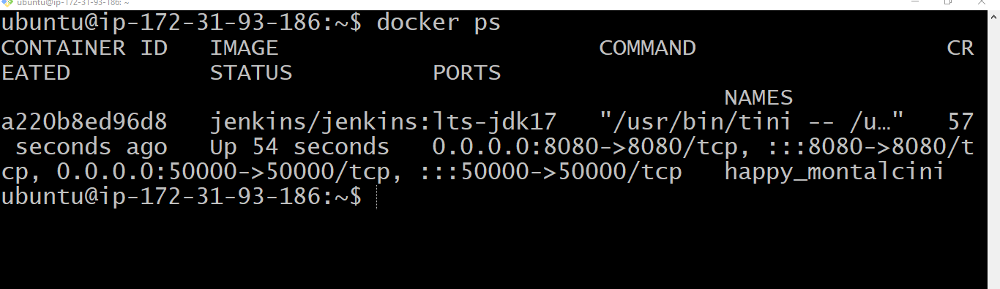
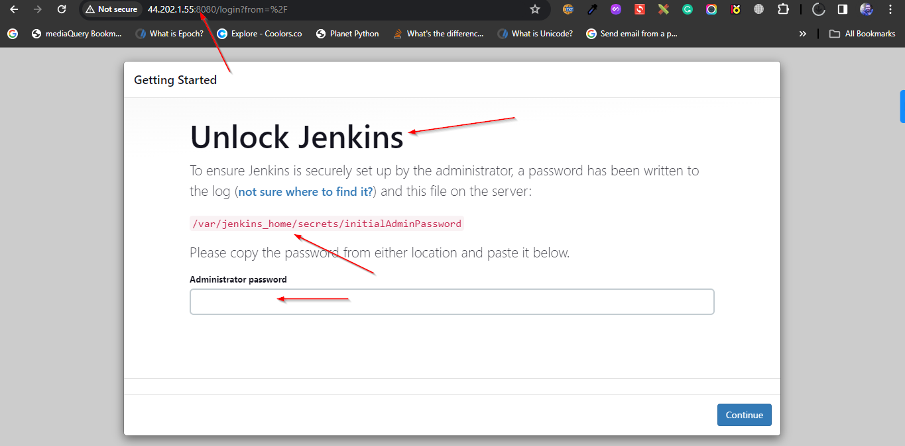
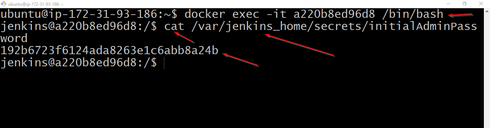
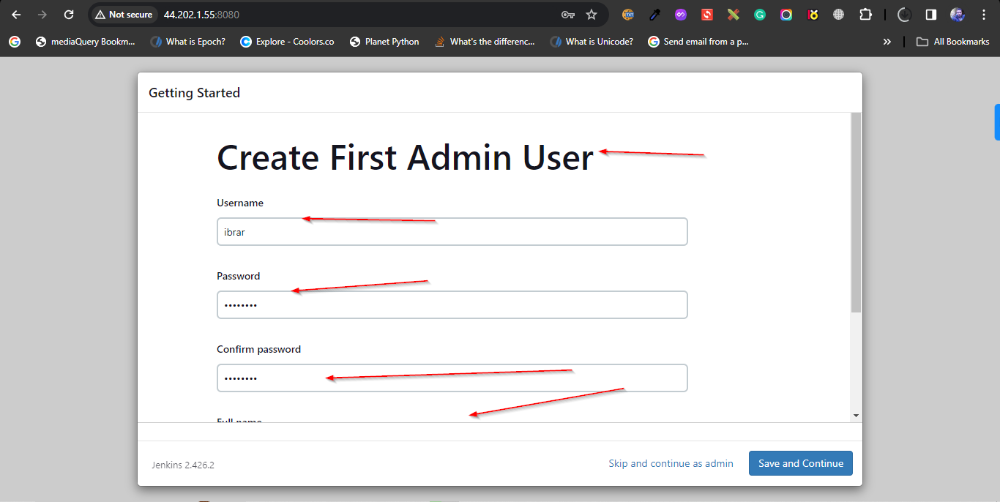
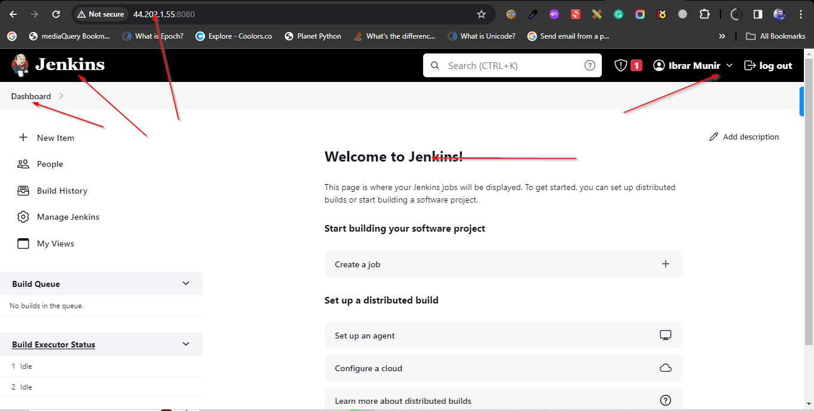

## Install Jenkins on AWS EC2 using docker image

Jenkins is an open-source automation server used primarily for continuous integration (CI) and continuous delivery (CD) processes in software development. It helps automate various stages of the software development lifecycle, including building, testing, and deploying applications. Jenkins allows developers to integrate code changes more frequently and detect issues early, ensuring the quality and reliability of software releases.



## Pre-Requisites:

1- Setup AWS EC2 with t2 small instance type
2- You know how to SSH to remote server



## Steps:

1- Install docker engine

```bash
sudo apt update -y
curl -fsSL https://get.docker.com -o get-docker.sh
sudo sh get-docker.sh
```




2- Run docker command to run jenkins container

```docker run -p 8080:8080 -p 50000:50000 -d -v jenkins_home:/var/jenkins_home jenkins/jenkins:lts-jdk17```





3- Find the admin password by accessing terminal of jenkins container.

```docker exec -it a220b8ed96d8 /bin/bash```
```cat /var/jenkins_home/secrets/initialAdminPassword```



4- Install the suggested plugin and create a admin user.




