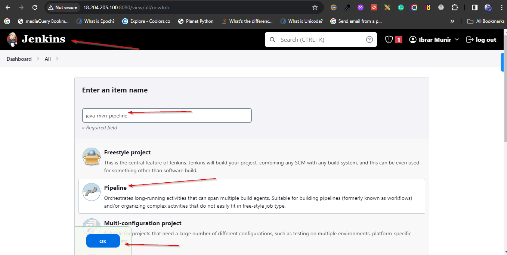
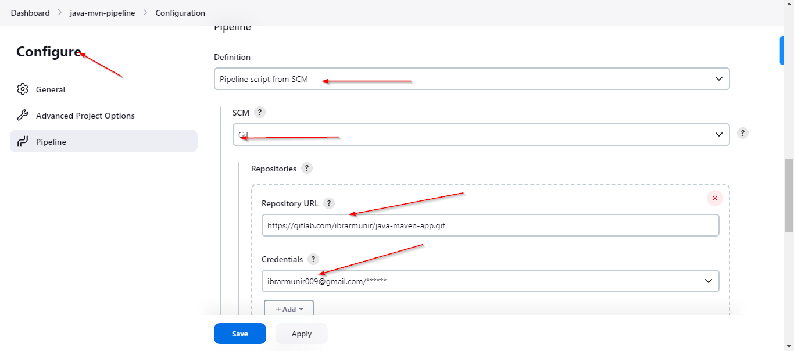
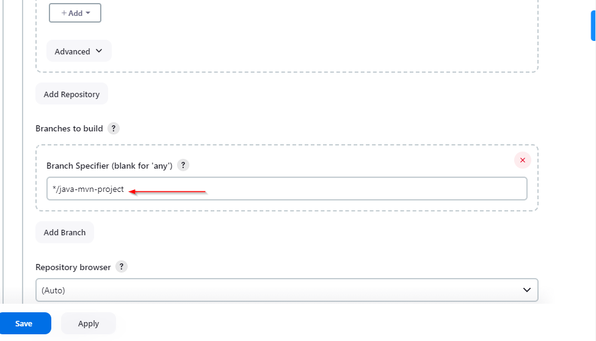
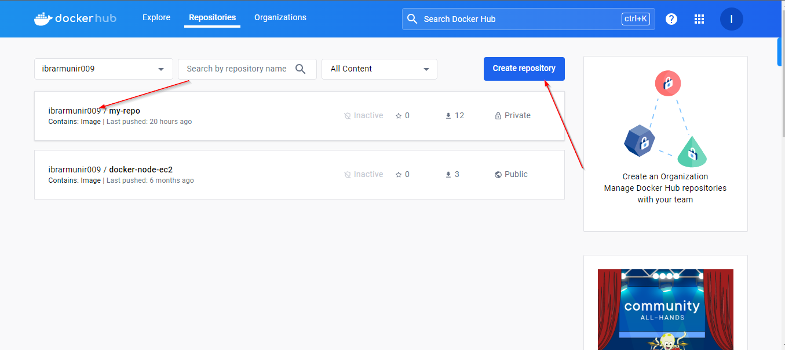
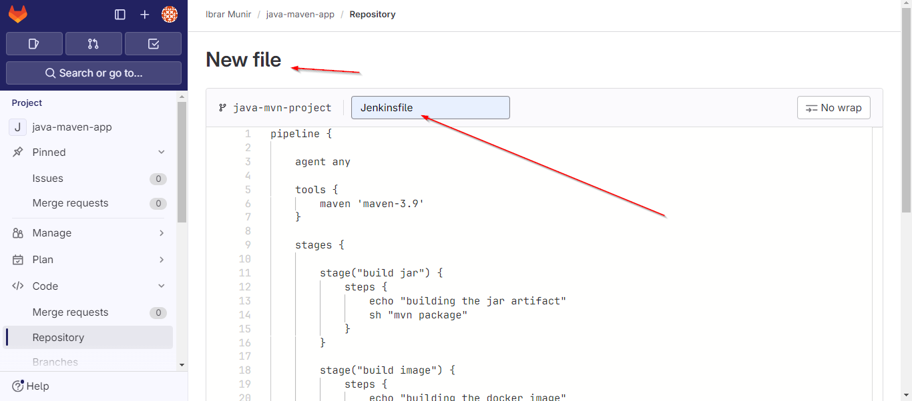
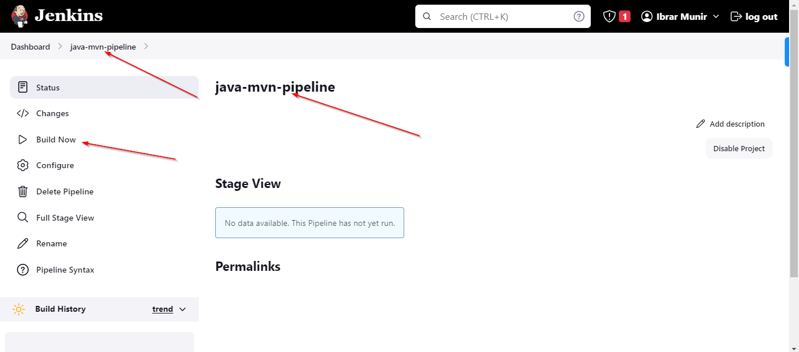
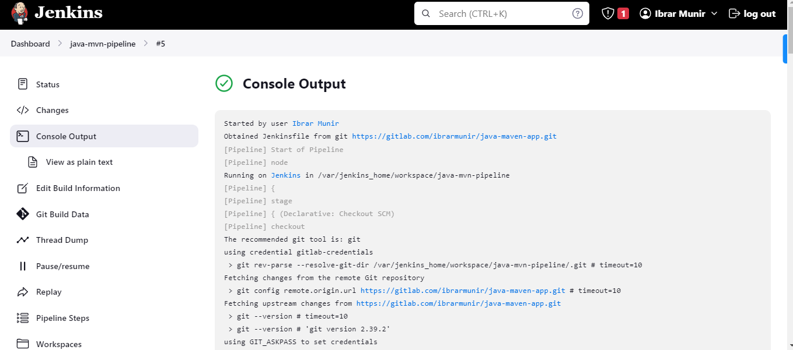

## Project: Setup CI for java maven application with docker


## Overview: 
In this project, we'll set up a Continuous Integration (CI) pipeline for a Java Maven application using Jenkins and Docker. The focus is on automating the build process triggered by code changes, containerizing the application with Docker, and integrating testing.

## Prerequisites:
Ensure that Jenkins is installed on your server.
Docker should be installed on the Jenkins server to run Docker containers.
The Java and Maven installations should be configured on the Jenkins server.

## Steps: 

1- Create a pipeline job on the jenkins



2- Next step would be to configure pipeline with git repository.




use this repo if you want to perform same steps on your end:

```https://gitlab.com/ibrarmunir/java-maven-app.git```

3- Setup Docker Private Repository



4- Use the following pipeline script and create a file in the git repository with name "Jenkinsfile":

```groovy
pipeline {

    agent any

    tools {
        maven 'maven-3.9'
    }

    stages {

        stage("build jar") {
            steps {
                echo "building the jar artifact"
                sh "mvn package"
            }
        }

        stage("build image") { 
            steps {
                echo "building the docker image"
                withCredentials([
                    usernamePassword(credentialsId: 'docker-hub-repo', usernameVariable: 'USER', passwordVariable: 'PASS')
                ]) {
                    sh 'docker build -t ibrarmunir009/my-repo:java-mvn-app-1.0 .'
                    sh "echo ${PASS} | docker login -u ${USER} --password-stdin"
                    sh 'docker push ibrarmunir009/my-repo:java-mvn-app-1.0'
                }
            }
        }

        stage("Deploy") {
            steps {
                echo "Deploying the application"
            }
        }
    }
}
```



5- Build the project 





## With Groovy Script

```groovy
def buildJar() {
   echo "building the jar artifact"
   sh "mvn package"
} 

def buildImage() {
    echo "building the docker image"
    withCredentials([
        usernamePassword(credentialsId: 'docker-hub-repo', usernameVariable: 'USER', passwordVariable: 'PASS')
        ]) {
            sh 'docker build -t ibrarmunir009/my-repo:java-mvn-app-1.0 .'
            sh "echo ${PASS} | docker login -u ${USER} --password-stdin"
            sh 'docker push ibrarmunir009/my-repo:java-mvn-app-1.0'
    }
}

def deployApp() {
    echo 'deploying the application...'
} 

return this

```

```groovy
def gv

pipeline {

    agent any

    tools {
        maven 'maven-3.9'
    }

    stages {

        stage("init") {
            steps {
                script {
                    gv = load "script.groovy"
                }
            }
        }

        stage("build jar") {
            steps {
                script {
                    gv.buildJar()
                }
            }
        }

        stage("build image") { 
            steps {
                script {
                    gv.buildImage()
                }
            }
        }

        stage("Deploy") {
            steps {
                script {
                    gv.deployApp()
                }
            }
        }
    }
}
```